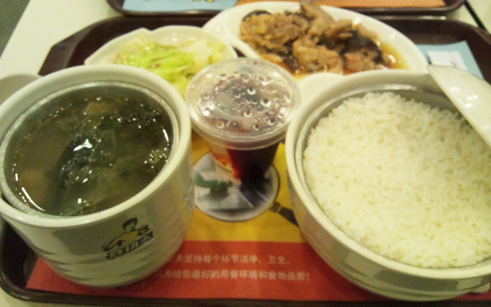
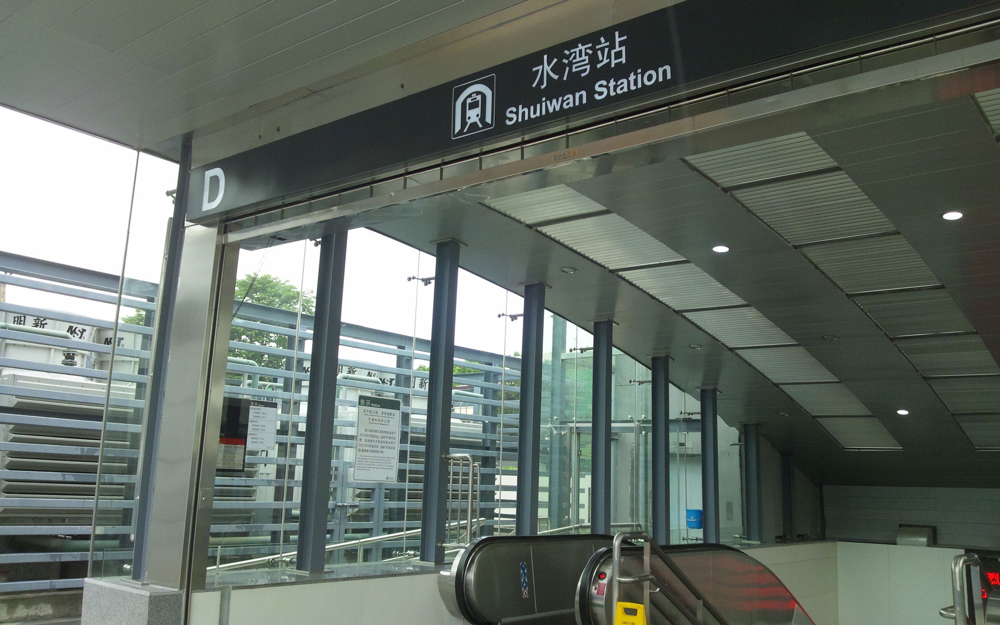

Twitterも何もできないのでVPNを利用してブログ更新しています。<!--more-->

香港の空港ではつぶやき放題だったのに、橋を渡ると事情も異なってきます。SNSはなーんにも接続できなくてブログサービスにも繋がらない。仕方がないので安いVPNサービスを契約しました。中国でネットをするならVPNは欠かせないかもです。  
こちらは暑いですが、エアコンをかけて涼しく過ごしています。
特にやることはないですが、買い物かなぁ・・・。  
今週は香港に行きますのでスイーツなんかを食べられたらいいなぁ、と思ってます。今日は新しくできた地下鉄を使ってジャスコまで行ってきました。地下鉄の駅までは歩いて20分くらい。ちょっと遠い・・・。  
ジャスコは何度も行ってますが、地下鉄では初めて。駅は「后海」で降りて徒歩10分くらいで着きます。地下鉄はキレイで非接触式コインで改札、降りる時はコインは自動改札で回収、という新鮮なシステム。  
帰りは買い物したのでタクシーで帰りましたが、便利かも。  
ジャスコの地下にフードコートがあって「真功夫」というお店に行ってきました。  
以前からロゴマークに興味があって、中国ではどこでも見るお店なので「おいしいのかなぁ」と常々思っておりました。早速注文。もちろん中国語は分からないので「コレとコレをクダサイ」みたいな感じの片言で注文。みんなが食べてそうなランチメニューがあったのでそれを一つと、米粉の麺があったのでそれを一つ頼んでみました。  
あっさりしていて意外にイケる。フランチャイズなので味が安定しているのかどうかはわかりませんが、これはいいかも。

