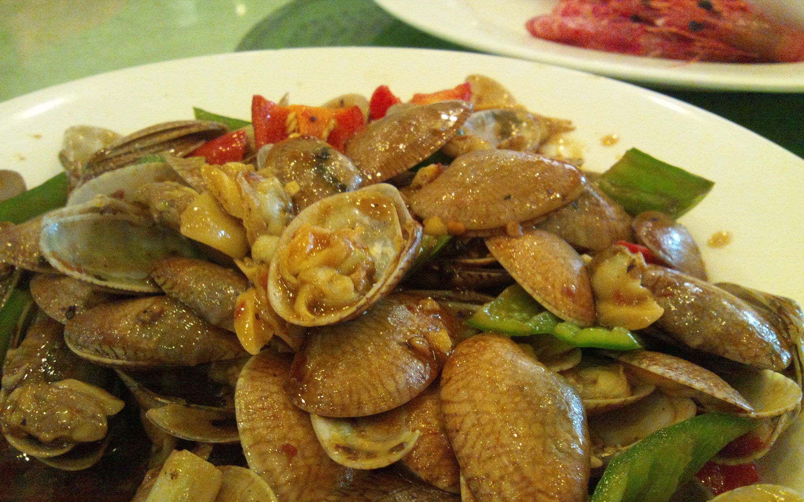
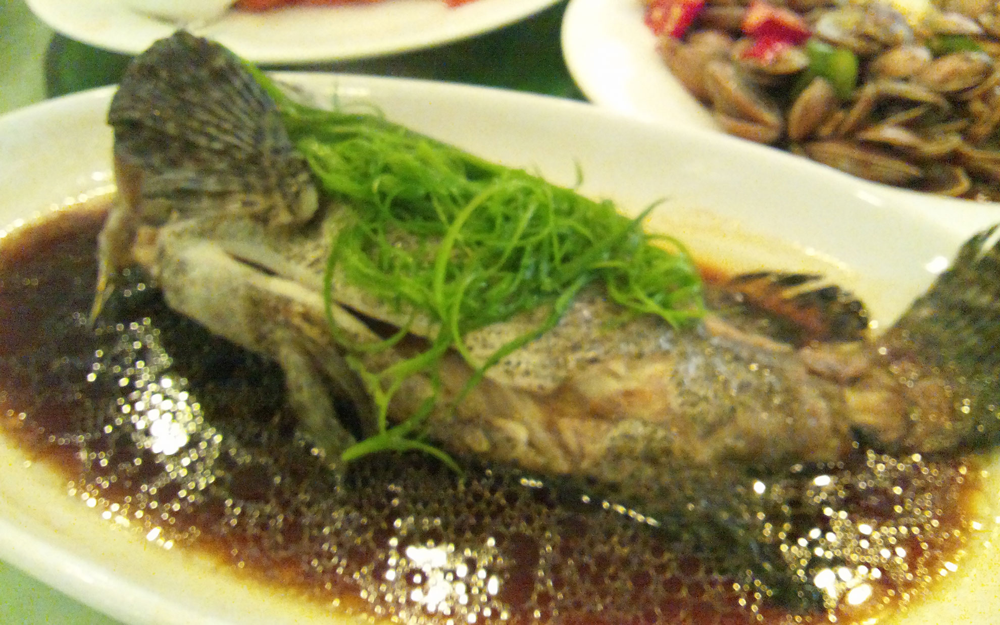
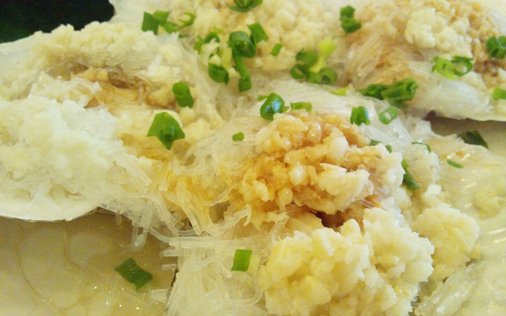
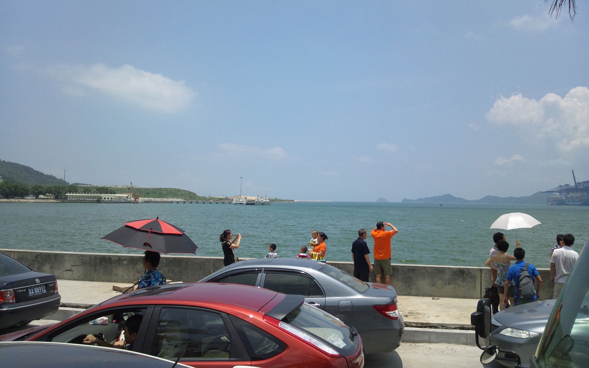

高級料理に興奮しました。<!--more-->

深圳から少し離れたところに塩田というところがあります。  
海鮮料理を出す店が並んでいて、週末になると多くの観光客が海の幸を満喫しにやってきます。  
今日は師公会海鮮酒家(塩田店)に行って海鮮料理を堪能してきました。  
メニューはなくて生簀の魚などを選んで調理方法などを指定して調理してもらいます。  
そのため中国語ができないと注文するのが難しい・・・。  
食べたのは鱈の煮込みとアサリの炒め物、海老の塩茹で、鮑の煮物、ホタテのニンニク春雨、などなど。  
これだけ食べて一人2,000円しないのでお値打ちかも！現地の人も観光バスで食べにくるほどの人気です。どれも味付けは薄味でさっぱりしていて美味しかったです。特に鮑はおいしかったなぁ。  

