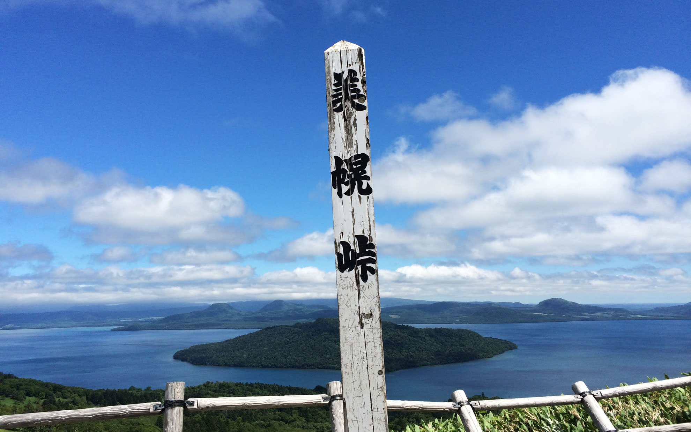
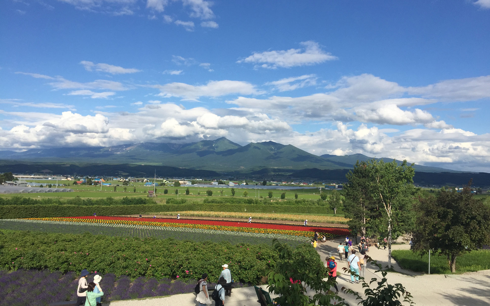
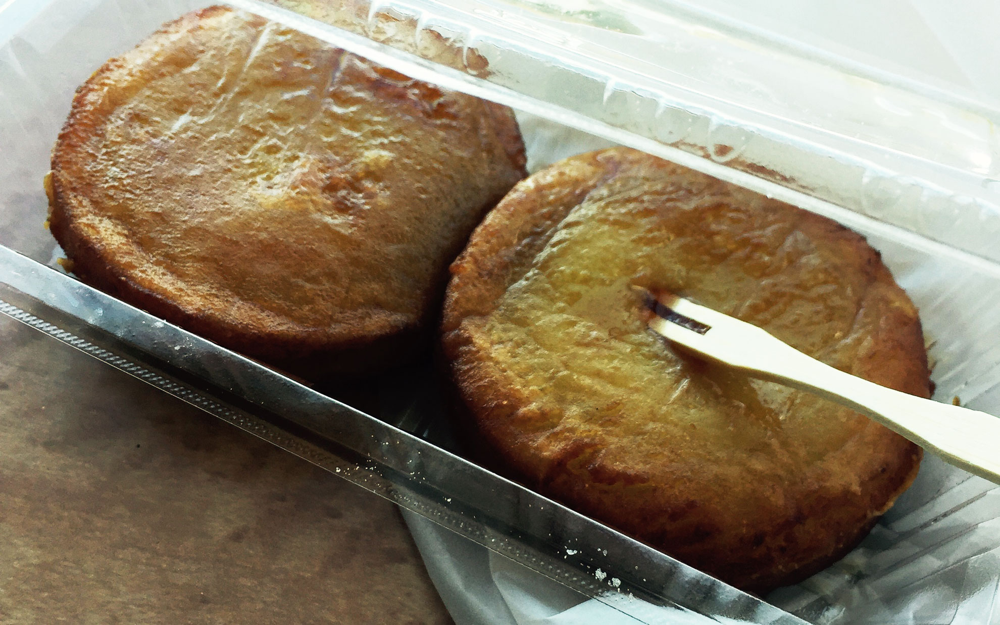

久しぶりの北海道ですが、道東は初めて。<!--more-->

久しぶりに北海道へ行ってきました。  
富良野から釧路、厚岸や網走へレンタカーをかりてドライブをして美味しいものを食べてきました。  
豊かな農地が拡がる大地はヨーロッパを思い出させてくれる風景でした。  
とにかく規模が大きいです。道路も直線が多く、ロードバイクで走ったら気持ちいいだろうなぁと思っていたのですが、いつまで走っても町が見えてこないこともあるので、補給や工具などしっかりした装備で走らないとコンビニや自販機がない場合大変なことになりそうです。  
梅雨の愛知を離れて涼しく晴れあがる北海道に行けたのは、本当に精神的にも鬱々とした気持ちを吹き飛ばしてくれるくらい良かったと思います。

