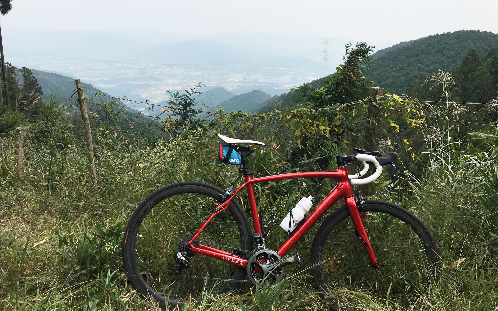

本宮山はしんどい！<!--more-->

年末に浜名湖一周して疲れてしまってから年が明けてしまい体調も良くなかったので寝てばかりの生活でしたが、一念発起して寒風吹きすさぶ中ロードに乗ってきました。  
寒さ対策はRaphaのジレを新たに購入して冷たい風をシャットアウトし、Buffを首に巻いて熱が逃げないようにしました。お陰で本宮山の山頂は気温０度で風も強かったので体感温度はかなり低かったと思うのですが、快適なサイクリングができました。  

いっぽう、体力も筋力もないのにヒルクライムに挑戦したので足が攣ったりお尻が痛くなったりして大変でしたが慣れれば問題ないと思います。  

本宮山山頂の砥鹿神社奥宮で参拝し、富士山も拝むことができて満足しました。  
また体調が良かったらサイクリングしたいと思います。  

  