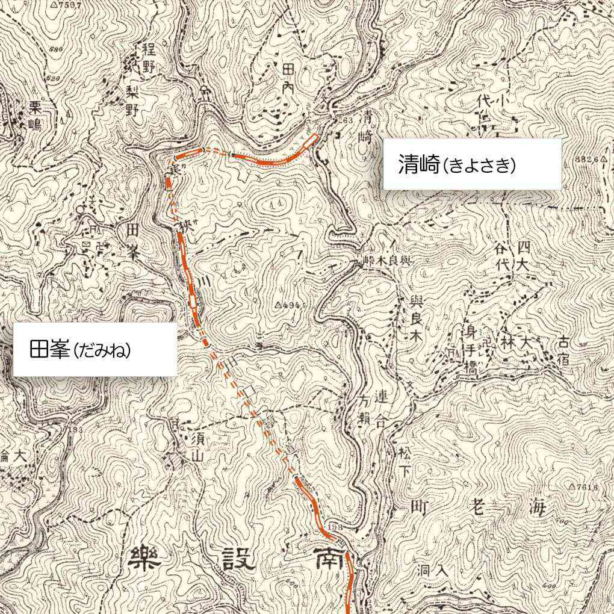
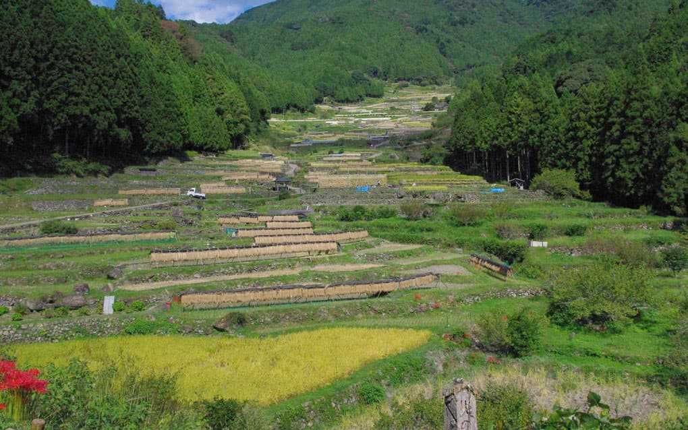
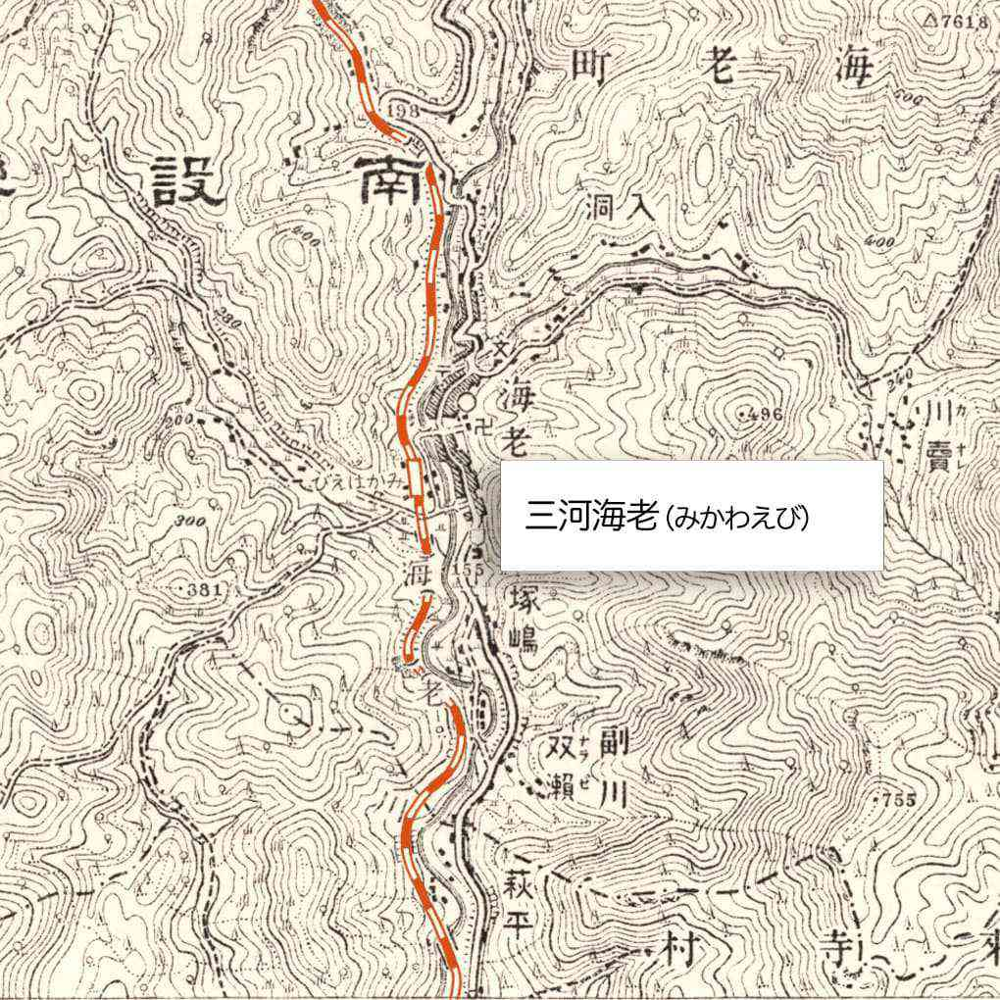
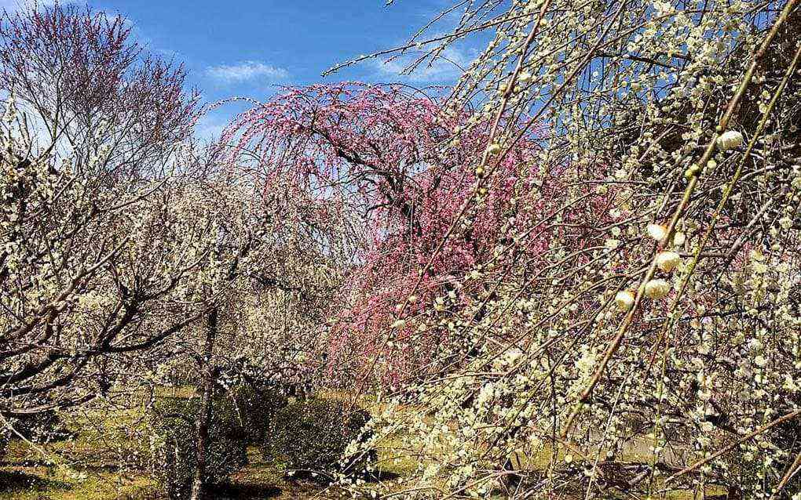
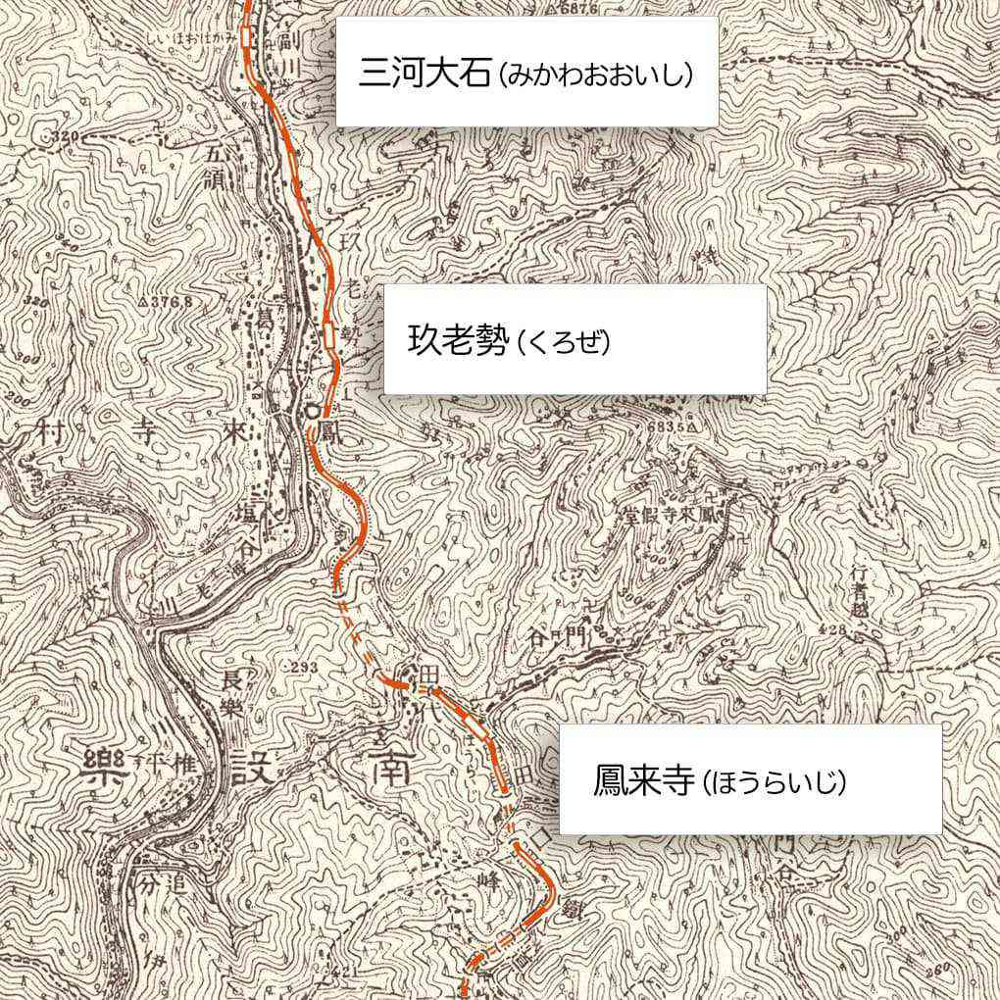
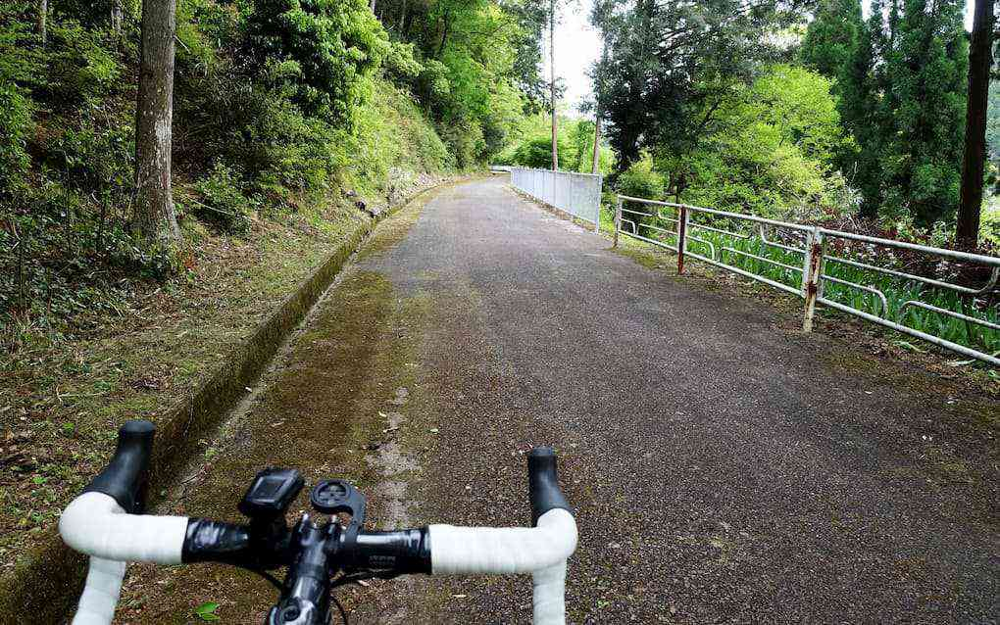
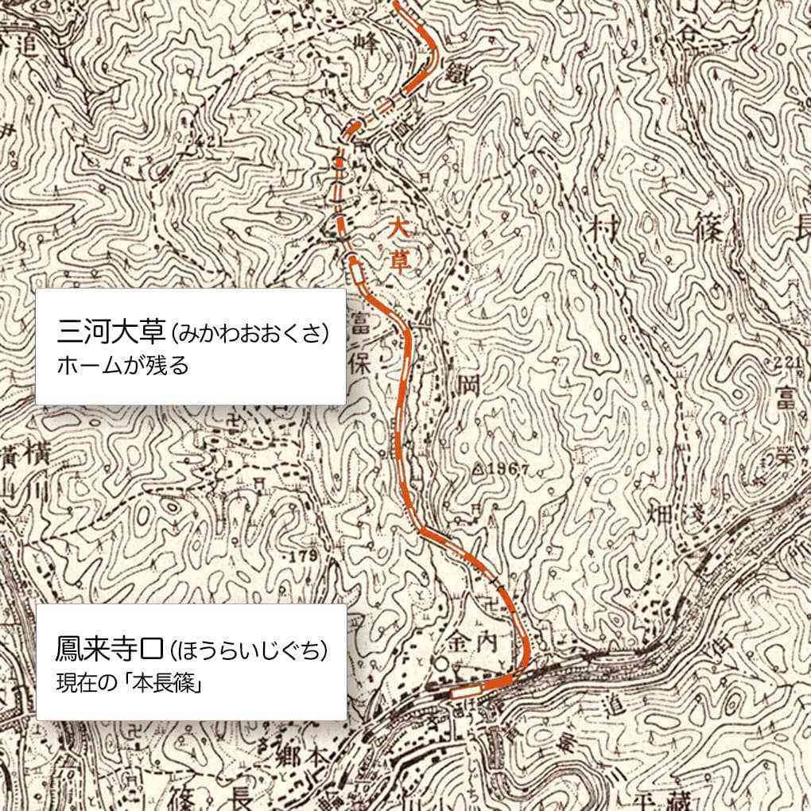
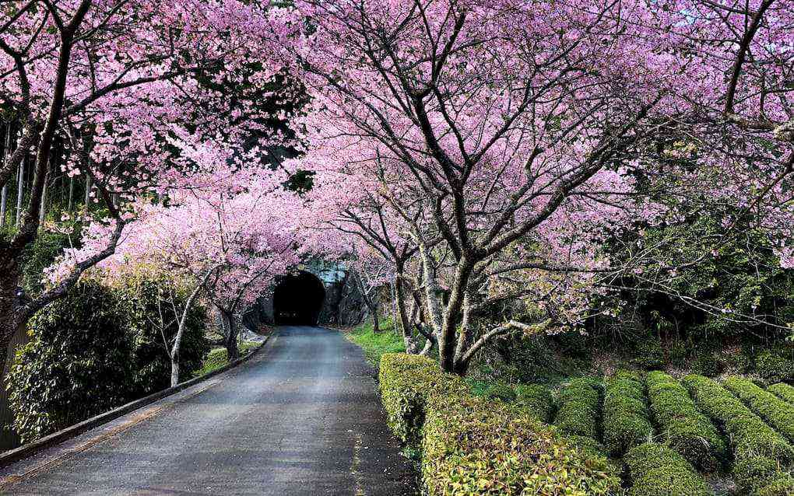

田口鐵道（旧田口線）が掲載されている奥三河の地図（昭和5年現在）を見つけたので線路に色を塗ってみました。
<!--more-->

もう何年かまえにSNSなどで知った方もいらっしゃるかもしれませんので今更感がありますが、スタンフォード大学がパブリックドメインで公開している「外邦図」を見ていたら田口線の路線が書かれたものを見つけました。明治23年測図、大正6年修正の地図に昭和5年現在の鉄道図を加筆した地図で、昭和7年に清崎〜田口間が開業するのでこの区間は地図には書かれていません。  
ダムで見られなくなる清崎〜田口間のトンネル群に比べると痕跡を探すのが難しいかもしれない清崎〜本長篠間ですが、この地図を手がかりにして自転車に乗りながら（時には降りて歩きながら）写真を撮ってみるのも悪くないかなと思っています。  
　  
なお、外邦図はさまざまな機関で公開・保存されていますが、各機関によって著作物についての方針は異なります。今回選んだスタンフォード大学ではライセンスがPDでしたので転載・加筆させていただきました。  
　  
ページが上からスクロールするWebの都合上、北から地図を載せていくことにします。  
　  　  

### 清崎〜田峯〜稲目隧道
海老から清崎へと抜ける稲目トンネルは自動車での移動にかかせないものとなっているのですが、もともと田口線を開通させるために開削された稲目隧道というのがあったというのを今回はじめて知りました。田口線廃線後はバス専用トンネルとして利用されていたそうですが、一般の人も利用できるように改修工事がなされて昭和54年（1979年）に開通されて現在のように便利なトンネルとなっています。  
田峯駅ができたのは昭和5年（1930年）のことなので、90年ちかく前に1.5ｋｍの隧道を開削したというのは当時としてもすごいことだったのではないかと思います。なお、清崎の次の駅は「長原前駅」だったのですが、開設は昭和25年（1950年）、同じく田峯から稲目隧道を越えると「滝上駅」がありましたが昭和24年（1949年）開設なのでこの地図には駅の表記はありません。  
　  
稲目隧道を清崎方面へ北東に登る道がかつての伊那街道の与良木峠（與良木峠）で、与良木峠手前の連合から北東に行くと千枚田でおなじみの四谷があります。  

  

  
　  
### 三河海老
海老村は昔から伊那街道の宿場町として栄えていたそうで、確かに歴史のありそうな雰囲気は街中を走るとそこかしこに感じられます。今まで走っていた道路も宿場町に沿っていたのですが、2017年（平成29年）に街を迂回するバイパスが開通しました。道幅も広く、おかげで今では安心して走ることができます。  
この地図の右側にある「川賣（カオレ）」と書かれている集落は「川売（かおれ）の梅」が人気で春になると梅を愛でに各地から多くの人が訪れる名所です。  
　  
  

  
　  

### 三河海老〜玖老勢〜鳳来寺
海老から海老川に沿って南下していくと大きな岩を見つけられると思います。この近くに三河大石駅がありました。川を挟んで対岸側は今「やまびこの丘」になっていて、むかしキャンプをした時お世話になりました。Google Mapsを見てみると三河大石駅のレプリカがあるそうなんですが、ちょっと見過ごしそう。  
玖老勢から鳳来寺へと抜ける線路跡は鳳来寺小学校まで残っていて、そのまま利用されています。現在のGoogle Mapsではその道が表示されないのですが、ここは地形を見ながら見つけ出してほしいなぁと思います。なんとなく普通の道と違うのがわかるかもしれません。  

  

  
　  

鳳来寺駅の駅舎は残っていないのですが、玖老勢〜鳳来寺駅間にあったトンネルが草木に隠れて存在しています。現在は立ち入り禁止です。個人的に思い出すのはキャンプ場に抜けるトンネルがあったと思うんですが、今では通れないようです。仕方がない。  

  
　  
### 三河大草〜鳳来寺口
鳳来寺駅から南南東へと線路は続き、いくつものトンネルを抜けて本長篠へと到着します。  
途中の三河大草駅跡は今や人気のスポットとなっている（と思う）ので知っている方も多いかもしれません。  
三河大草から川を越える橋の橋梁だけは今も残っていて、当時こんな高い場所を列車が走っていたのかと思うと少し興奮しますね。本長篠へと到着する前のトンネルと線路跡は今では河津桜の名所となっていて、僕もよく行きます。ここの桜は本当に見事で、ゆるやかに延びた道の先にトンネルがあるという光景も人の心に何か語りかけているような気さえします。  
　  
  

  

  

  

こうやって脳内でオリエンテーリングをするのも楽しいのですが、やはり実際に自転車に乗りながら訪ねてみるのが一番好きです。歩くには遠いし自動車では駐車できなかったり通行できない箇所もありそうですが、自転車でのんびりと訪ねてみるのがオススメかも。古地図のリンクを貼っておきますので、ぜひ現在の地図と実際の風景と照らし合わせて奥三河をめぐってください。  

　  

[Gaihōzu：Japanese Imperial Maps](https://stanford.maps.arcgis.com/apps/PublicGallery/index.html?appid=1ed3022fc7884690a2f137bce9dfe4fe)

　  
--- 以下地図の著作権などについて  ---  
　  

USE AND REPRODUCTION  
Image from the Map Collections courtesy Stanford University Libraries. This item is in the public domain. There are no restrictions on use. If you have questions, please contact Branner Earth Sciences Library & Map Collections at brannerlibrary@stanford.edu.  
　  
COPYRIGHT  
This work has been identified as being free of known restrictions under copyright law, including all related and neighboring rights. You can copy, modify, distribute and perform the work, even for commercial purposes, all without asking permission.  
　  
LICENSE  
This work is in the public domain per Creative Commons Public Domain Mark 1.0  
