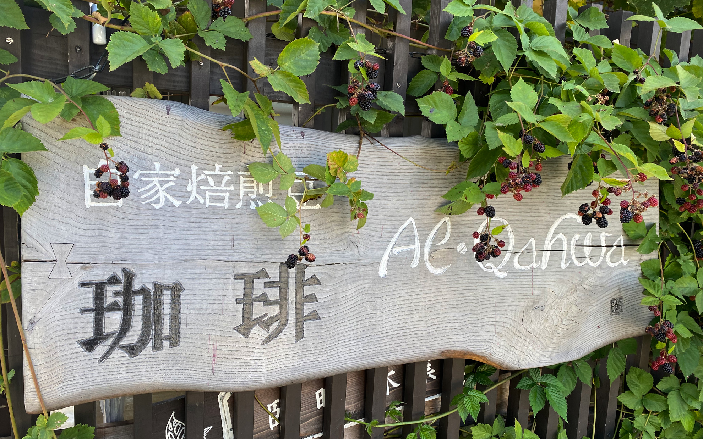
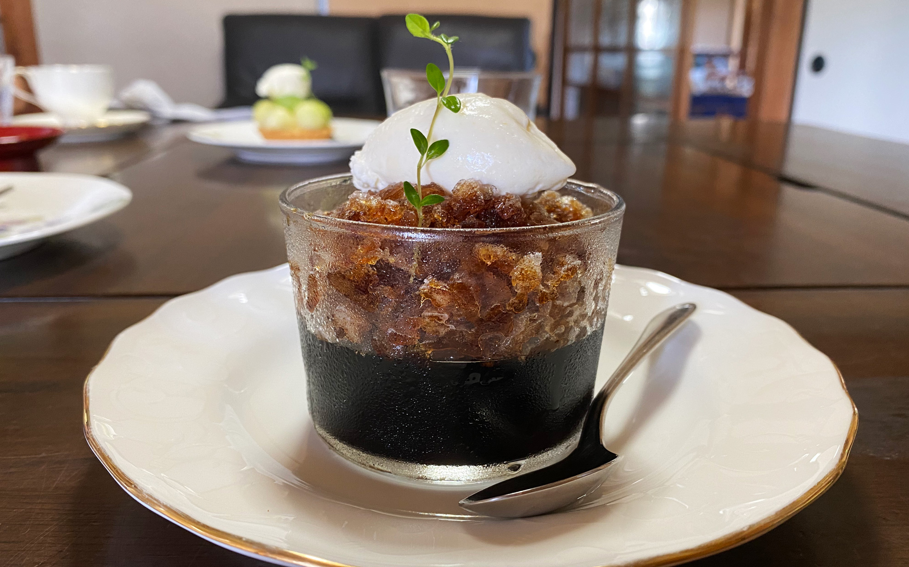

7月の連休はドライブへ。    
<!--more-->
　  

### 寝たきり卒業なるか

　ここ数年のあいだ、週末は一日中寝込んでいるのですが、ちょっとした変化が。  
午前中か午後のどちらかは起きていられるようになってきました。時間があれば少しだけ買い物やドライブに出かけることもできて、嬉しいです。本当は今日開催されたオリンピックの男子ロードレースを見に行こうと思っていたのですが、緊急事態宣言でコース沿道の駐車場は閉鎖されるという情報を見て自粛することにしました。仕方ないですよね。今日はiPadで動画をAppleTVに飛ばしてリビングのテレビで観戦していました。いやー、行きたかった・・・。  
そういえば新城にあるカフェ「アル・カファ」にも行ってきました。前から気になっていたので行けてよかった。コーヒーはもちろんのこと、コーヒーゼリーはお店のこだわりでゼリーとグラニテで違う豆を使っているそうです。  
　  
  
  
