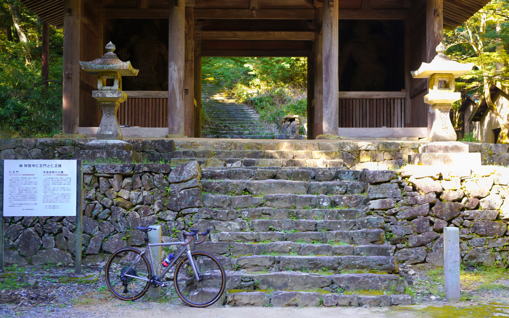
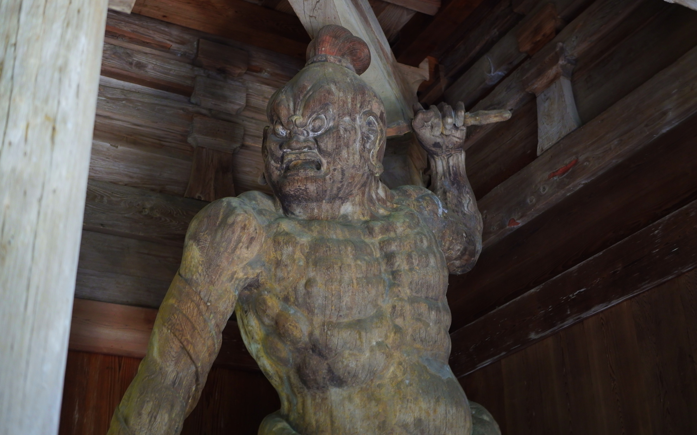

久しぶりに自転車乗りました。    
<!--more-->
　  

### ブログの更新頻度が下がってますね・・・。

　そもそもブログを始めるきっかけとなったのは、自分が鬱病の症状改善を目的に認知行動療法の一環としてfc2ブログのアカウントを作ったのが始まりで、当時はほぼ毎日投稿していました。  
それからブログをWordpressに移行して就職してからは週に1回くらいに頻度が下がり、さらに最近は月に1回の投稿もできなくなってきてしまいました。  
文章を考えながら書くのは嫌いではないのですが、自分が何かを好きでいられる時間というか、内なる炎の大きさというか、最近はそうしたものが萎んでしまっているような気がします。自転車は相変わらず好きだし、自転車のニュースはチェックしているんですが何故なんでしょうね。  
　  
　とはいうものの、今日は天気が良くて先月のような暑さも和らいで来たのでサイクリングへ行ってきました。杣坂は相変わらず通行止めなので財賀寺へ。  
森の中は涼しくて蝉の鳴き声とともに鈴虫の鳴き声が微かに聴き取れて、秋の入口がやってきたなぁと感じます。  
帰り道の田んぼではすでに稲刈りが終わったところもあって、過ごしやすい季節がやってきそうで嬉しく感じました。

　  
  
  
