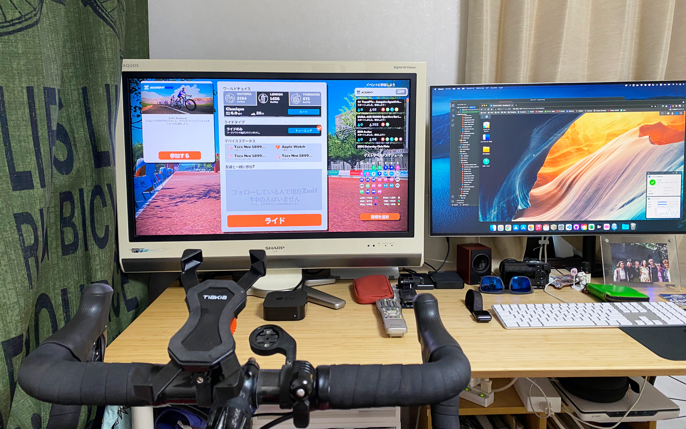
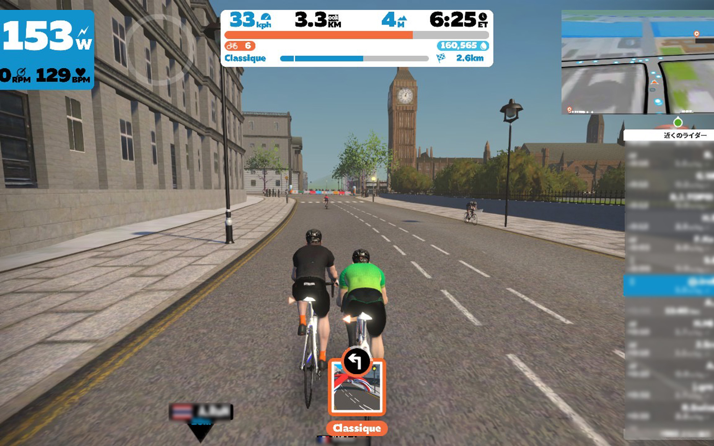
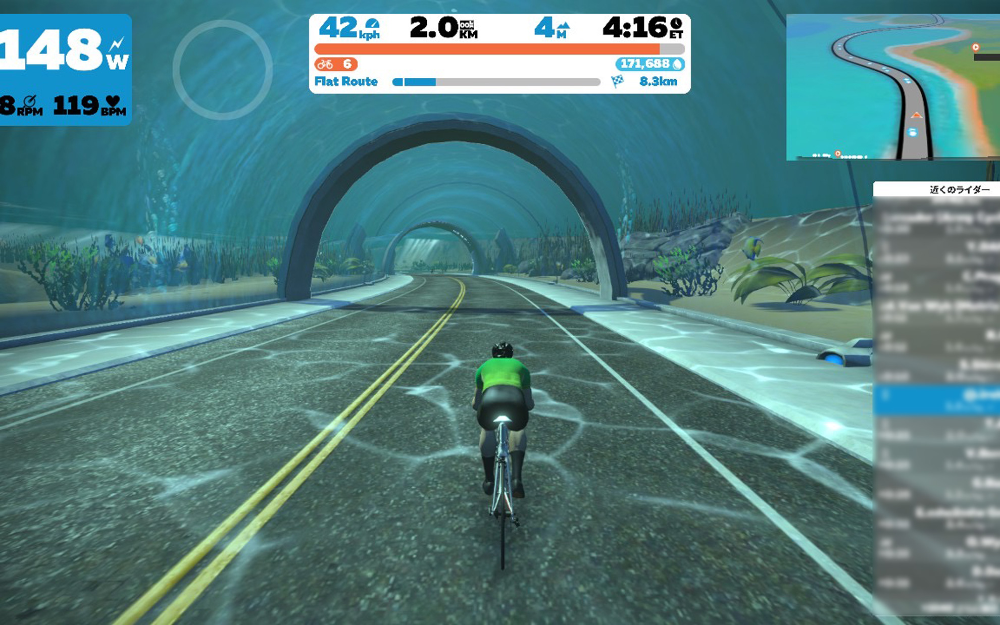
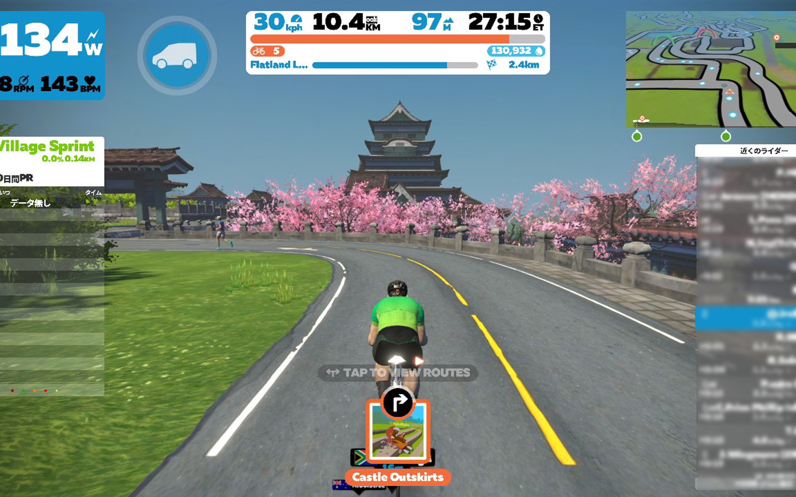

Zwiftって結構面白いですね（今更…。）    
<!--more-->
　  

### ハードルを極限まで低くしてみました。
部屋で使っていた32型のテレビを作業机の上にセットして、AppleTV専用機にしました。あとはiPhoneをハンドルにつけてZwiftを起動するだけで直ぐに遊べるようになったので凄く気軽に楽しむことができます。今まで結構Zwiftをやるのに「がんばるぞ！」と気合いを入れてのぞむことが多かったのですが、たいていの場合途中でダレてしまい、しかも最初から長めのルートを選んでいたので完走できずじまいでした。  
ということで、まずは一番短くて平坦なルートからクリアしていくことにしたところ、途中のスプリントポイントも楽しむことができて充実したトレーニングが結果的にできるようになりました。  
これは完全に個人の好みの問題なので人によって違いますが、僕の場合は目標を高めに設定してクリアできないケースが多くて、それで謎の敗北感だけを味わってきたのですが、こうやって楽しめるようになったのはとても小さいことながらも大きな喜びです。  
これからも少しずつ楽しめるようになりたいなと思いました。  

  
　   
　  
　  
  
  
  
  

