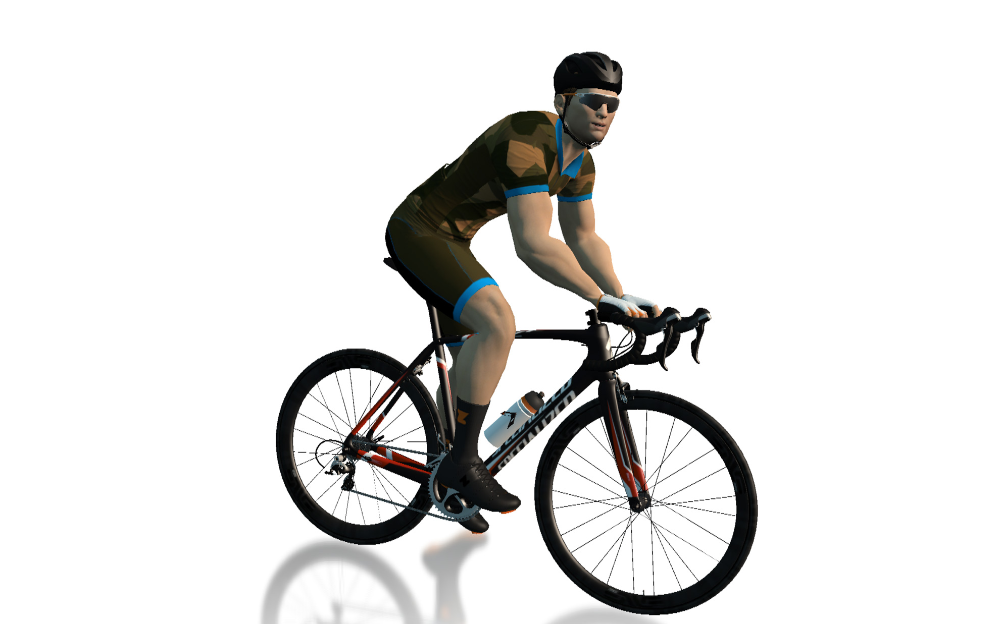
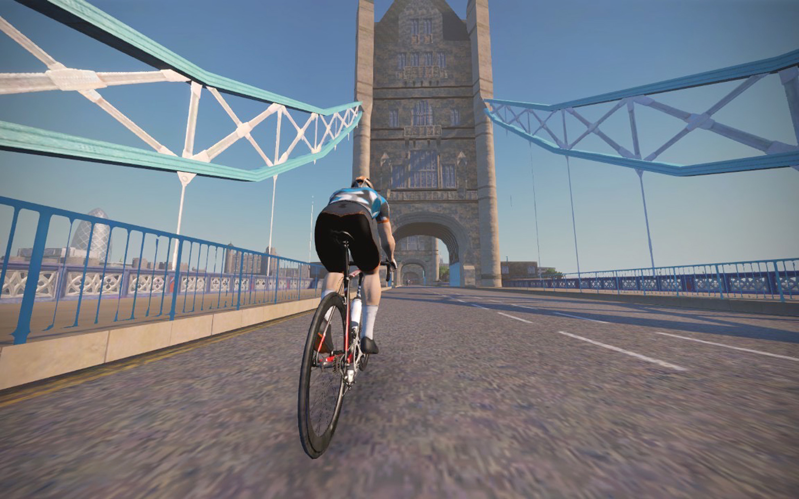
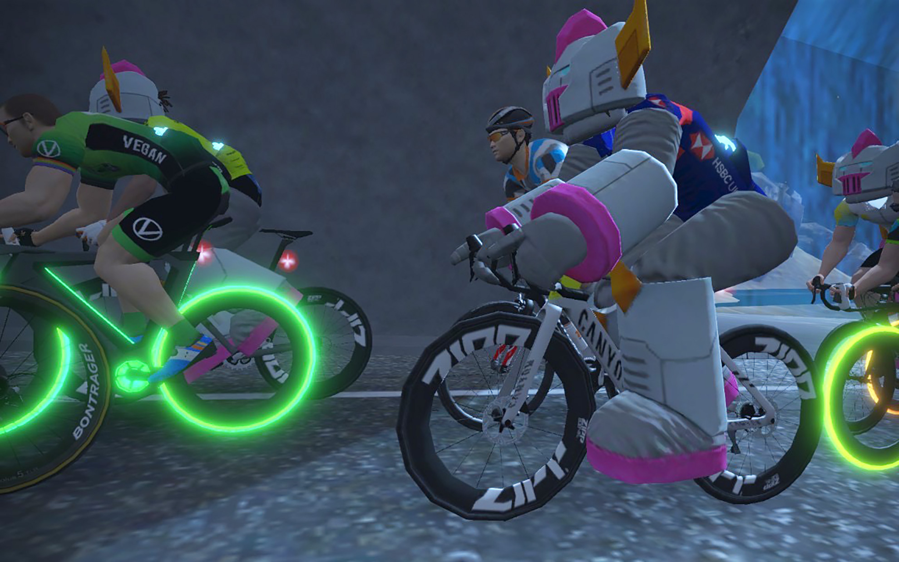

レベル10になったぞー！（Zwiftの）    
<!--more-->
　  

### コツコツと続くようになりました。
　なるべくハードルを下げ、気負わずにZwiftをやるようになってから気がついたらレベル10になっていました。  
夕方の食事前や、食事後など普段だったら外に走りに行かない時間帯でも「ちょっとやってみようかな・・・」と軽い気持ちで20分くらい走り、最近は1時間くらい走るときもあります。AppleTVと液晶テレビの組み合わせは非常にラクで、あとはiPhoneのZwift Companionをセットすればすぐにスタートでき、コースもなるべく短くて勾配が少ないものから選んでいっているので今のところ完走できています。
　  
とりわけ自分でも驚いているのが汗の量です。よく話には聞いていたものの、ローラー台ってこんなに汗をかくんですね・・・。今は始めた頃よりも汗が出やすくなっているような気がします。  
特に壮大な目標や義務があるわけではないのですが、なぜか気負ってしまう性格なので、これからもユルく楽しんでいきたいと思います。  

　  
　  
  
  
  
