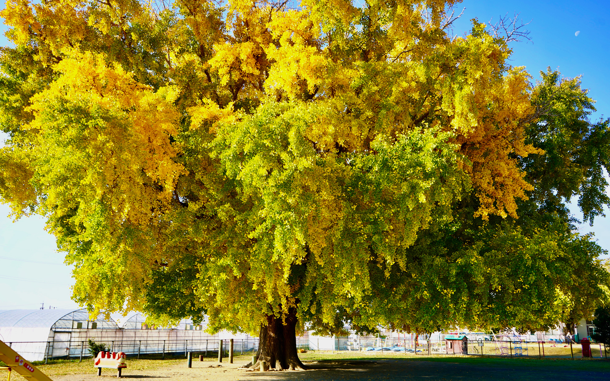
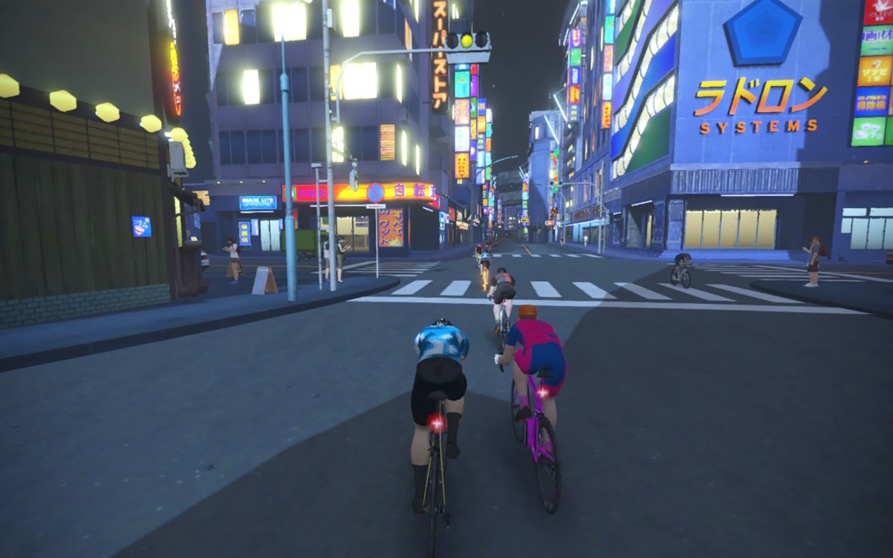
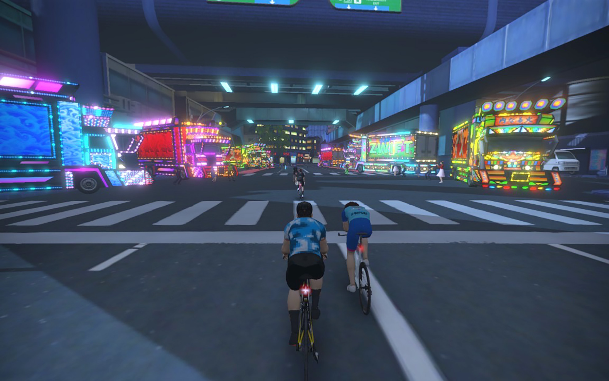

メタバースの世界から久しぶりに現実世界で走りました。    
<!--more-->
　  

### ローラー台の効果はあったのか分からない。
　朝起きて体調が良かったので久しぶりに自転車に乗って大和の大いちょうを見に行ってきました。もうここ数年は定期的に見に行ってますが、毎年イチョウの葉っぱの表情が違うので面白いですし、なにより迫力があって圧倒されます。  
　距離的に家から近いこともあって、自転車で走っても今までと変わりない感じですが、ローラー台に乗っていたお陰か、気持ち速く走れるようになったかもしれません。ゆっくりラクに走ることもできるんですけど、何故かいつも自転車に乗る負荷で走ってしまいがちです。もっとロングライドをしてみないと分からないなぁ。  
　　  
　Zwiftでは最近新しいマップの「NEOKYO」がリリースされ、マクリ島南部に組み込まれました。色々とルートを走っていますが、良くできていてニンマリしてしまいます。ちょっと昔に外国がイメージした日本っぽくもあり、下町の様子なんかは結構リアルだったりして走っていて楽しいです。  
　  
　バーチャルでも現実世界でも元気に自転車を楽しめるように体調には気をつけていきたいと思います。  　  
　  
　  
  
  
  
  
