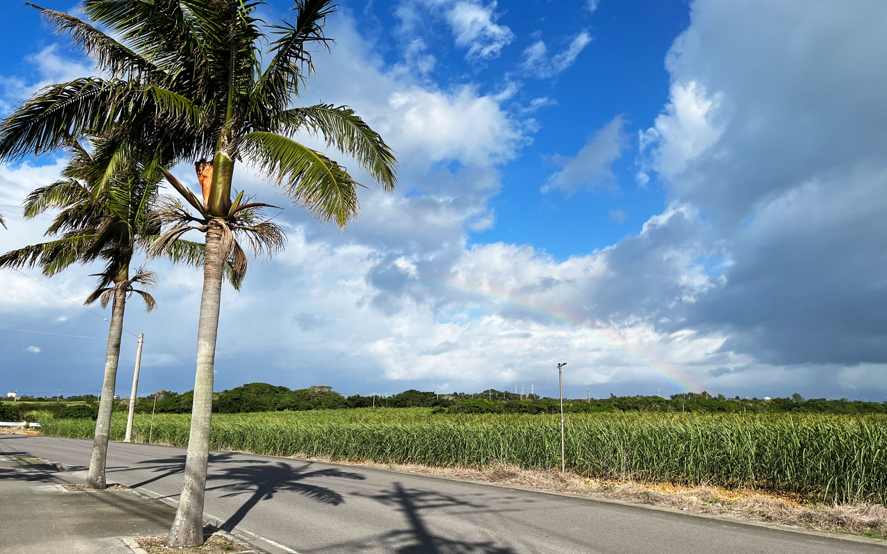
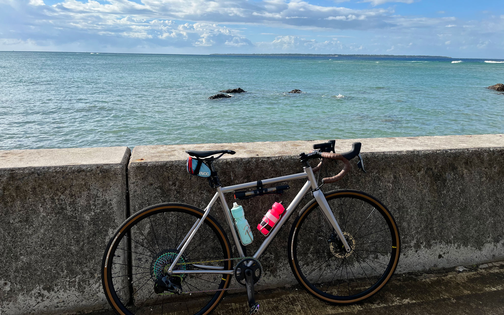
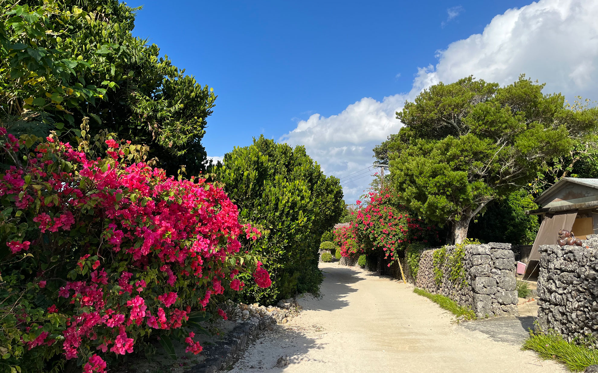

お休みを頂いて石垣島へ行ってきました。    
<!--more-->
　  

### 飛行機輪行ってどうやるの？
　お休みを使って旅行に出かけようと思い、候補に浮かんだのが暖かい石垣島でした。ちょうどピーチで往復航空券が中部国際空港からお値打ちで販売されており、自転車を預けても同じ区間の全日空の片道運賃より安かったのでチケットを購入しました。よく話で聞くのはフルサービスキャリアじゃないとフレームがボロボロになったり補償もされずにトラブルになるという経験談で、そのあたりは非常に心配したのですが、結果的に運良く無事に？輪行して帰ってくることができました。  
　  
とりあえず今日現在で気をつけたいことは以下の通りです。  
　・タイヤの空気は必ず抜く。  
　・ガスボンベは持ち込み不可。  
　・タイヤ・ペダルは外す。自分の場合はローターとディレイラーも外しました。  
　・電動変速のバッテリーは機内持ち込みにする。  
　・工具は輪行袋には入れずにスーツケースに入れる。（機内には持ち込めない）  
リチウムイオン電池は機内預けにはできないので、Di2の内蔵バッテリーもやっぱり外した方が良いらしいのですが、これは面倒だなぁ。空港で職員の方がチェックするリストの中に、電動変速のバッテリーについての記述があったので、多分チェックインの時には確認されると思います。  
　  
という面倒な儀式を通過して、石垣島で自分の自転車で走るのは気持ちがいい！  
レンタルサイクルも多くありますので、気軽にサイクリングをしたい方は現地で借りるのが良いと思います。
　  
久しぶりに半袖で走って気持ちがいい気候で、楽しかったです。
　  　  
　  
  
  
  
  