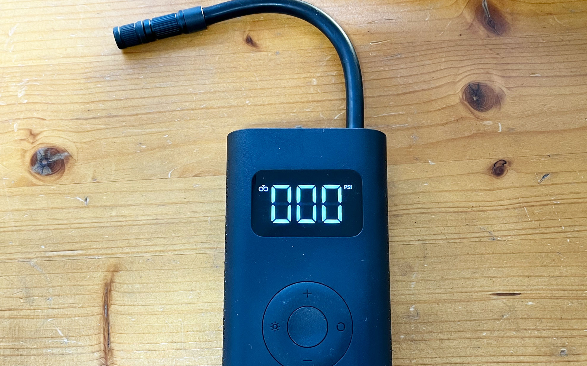
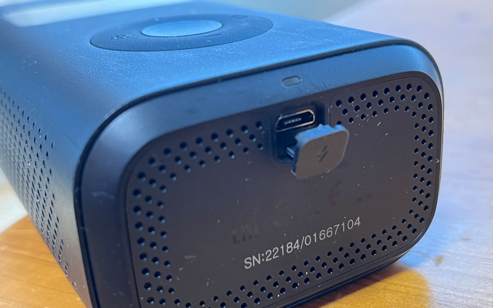

最近Amazonで見かける電動空気入れを買いました。    
<!--more-->
　  

### これは・・・iPodなの・・・？
　充電式で簡単にエアーが入れられるならいいのでは・・・と思い、色んなメーカー（だいたい中華）を見ていたのですが、スマホでお馴染みのシャオミがなぜか電動空気入れいを販売しているので気になって買ってみました。見た目はあえて言うならばiPodそのまんまなのですが、届いたモノはその何倍もある大きさで、結構嵩張ります。実は先日石垣島へ遊びに行った時に持参して、ホテルでバイクを組み立てる時に使いました。昼間だったので隣室に誰もいないことを願いながら、「ンゴゴゴゴゴ…！！」とごう音を上げて空気を入れましたが、おかげで楽でした。  
　  

<blockquote class="twitter-tweet">
これは重低音が売りのXiaomi製iPodみたいな空気入れ。夜は使うのを少し躊躇う。 <a href="https://t.co/zCEBRNEmij">pic.twitter.com/zCEBRNEmij</a>
&mdash; イロハカ (@irohaka) <a href="https://twitter.com/irohaka/status/1448880489385771010?ref_src=twsrc%5Etfw">October 15, 2021</a></blockquote> 
  

　見た目とは違い、ホイール式で操作するわけではなく、全部スイッチなので形状をこのようにする必要性があったかどうかは分かりませんが、”＋、ー”で空気圧を調整し、”◯”で自転車、オートバイ、自動車、ボールの空気を入れられるように選択できます。一応自動的に設定した空気圧になればストップするようになっているらしいのですが、あまり信用していないので、そこは適当に空気を入れるようにしていますが、慣れるとなかなか便利です。  
もっと静かで小さな空気入れもひょっとしたら出てくるかもしれませんね。結果的に買って満足です。  

  
  
　

