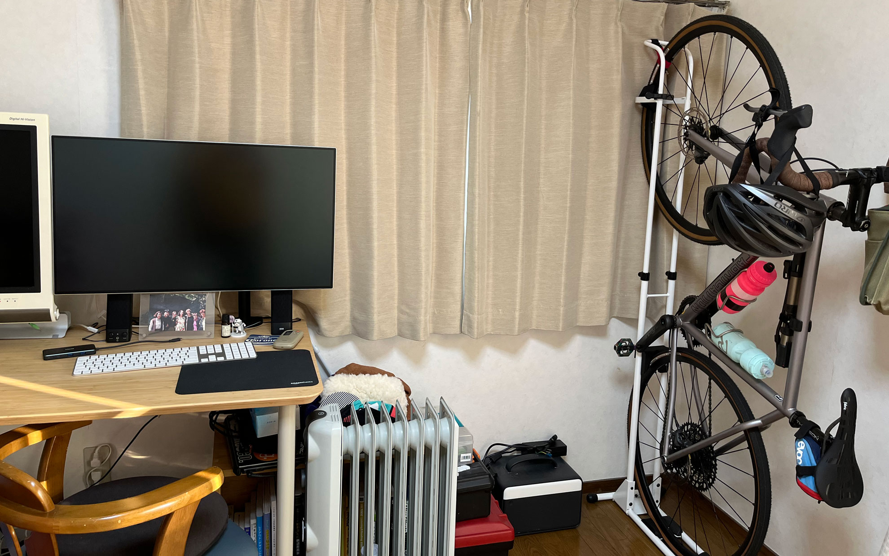

縦置き型は省スペースでオススメ。    
<!--more-->
　  

### 横置きは場所を取る
　新年明けましておめでとうございます。2022年もよろしくお願いいたします。  
　  
　以前にもバイクタワーを買ってバイクを二段置きをして自転車の置き場所を考えあぐねていたのですが、最近DIYブームが自分の中にも到来したので「これは作ってみよう」と木材を買ってスタイリッシュに縦置きのスタンドを自作してみようと考えました。しかしながらブームが去ってしまい、縦置きにしたい欲だけが自分の中でモヤモヤと残ってしまったので、結局Amazonで買いました。  
　今は選択肢も割とあるので検討した結果、iWA(丸八工機)のスタンドを購入しました。組み立ても容易で部屋の隅に置いてみたところ、割と収まりが良くてスッキリとした気がします。一応ベルクロを補助でフロントタイヤを固定していますが、あった方が安定感が増してオススメです。  
　  
　注意点としては、立ててあるバイクのそばでゴソゴソしていて不用意に立ち上がるとハンドルが頭に刺さりそうになる点（自分が注意する点）くらいです。なのでハンドルにはヘルメットを引っ掛けておいてますが、製品として特に不安定とか不満な点は一切なく、買ってよかったとかなり満足しています。横置きもできるそうですが、縦置きの省スペースのメリットは大きいかなと思います。  

  
　

