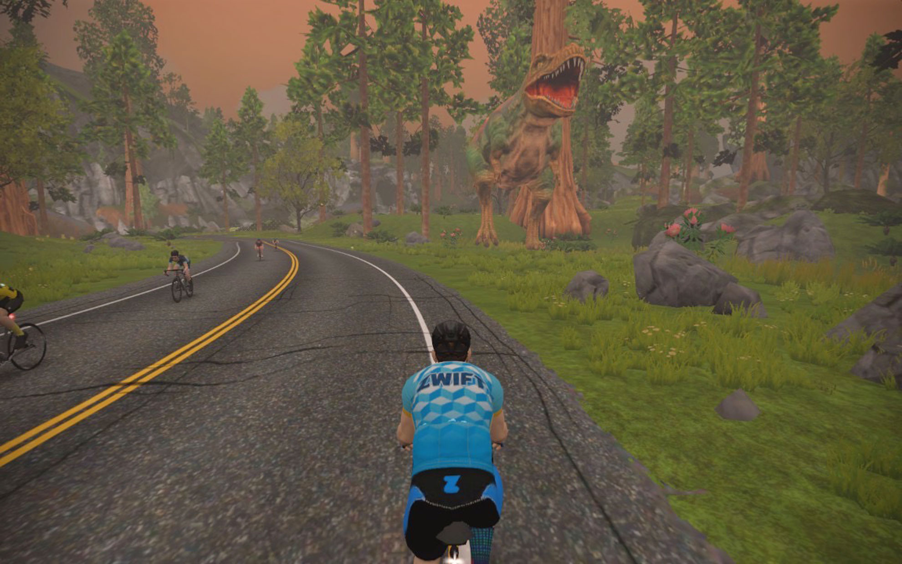
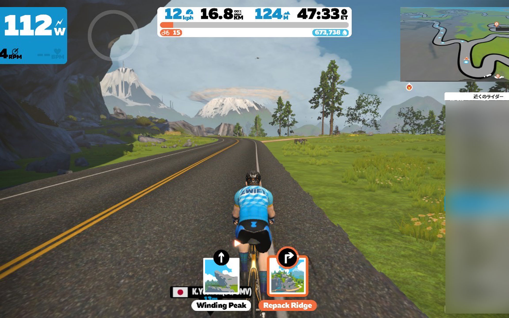
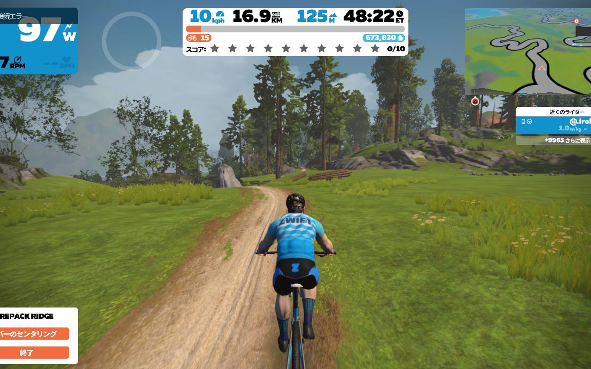

以前から気になっていたZWIFTのMTBモードを試してみました。    
<!--more-->
　  

### ZWIFT COMPANIONが必要です。
　結構前の話でZWIFTでハンドル操作を伴うMTBモードがあることは知られていましたが、あまり興味がなかったので放置していました。ちょっと最近そのことを思い出して調べてみたところ自分の環境ですぐに出来そうだったので試してみました。  
ハンドルにiPhoneを固定し、ZWIFT COMPANIONを起動します。ハンドルが切れるように前輪を固定しないようにします。できれば回転する板があればいいのですが、今回はお試しで床にフロントホイールを直置きにしました。  
　  
次にZWIFTのWatopiaで砂漠のルートを選択します。僕が選んだのは「Sand and Sequoias」です。通常砂漠を経由してセコイア並木を越え、恐竜が歩いている山Titans Groveを抜けるルートです。


<b>このルートが始まったらまずUターンをします。</b>僕は普通に走ってしまい、遠回りをしてしまいました。


　Titans Groveに近づいてくると、右手にMTBのコースが見えてきます。コース選択で「Repack Ridge」が表示されるので、右ルートを選択します。そうすると、ZWIFT COMPANIONの固定したハンドル操作でMTBルートを走りますかという質問があるので、ここで「レッツゴー」を選択するとMTBルートを走れるようになります。  

  
　  
　仕組みとしてはハンドルバーに固定したスマホの動きに連動してZWIFT内のMTBのハンドルも動くのですが、当然ながら実際のMTBとは全然違います。こんなにハンドル切ったら転ぶだろうなぁとか思うところはありますが、それでも面白いです。ちなみにコースから外れそうになると失速するだけで、オープンワールドみたいにどこへでも行けるわけではありません。それでもこの試みは面白いのでどんどん続けてほしいなぁと思います。
　  
  
  
  
　  


