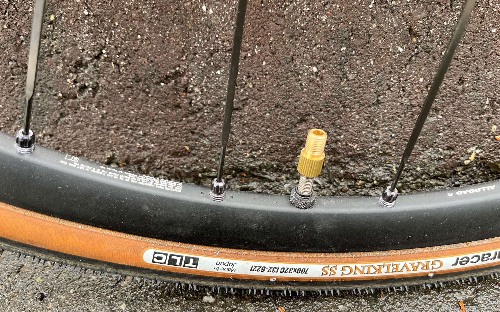
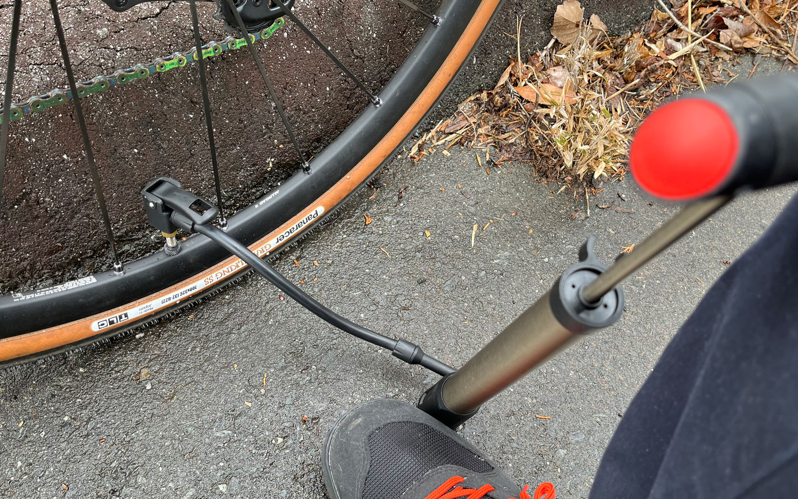

パナレーサーのポンプ、とても使いやすいです。    
<!--more-->
　  

### よく考えられた機能
　パナレーサーの携帯ポンプを購入してしばらく使っていますが、これはポンプ沼にハマっている人にもおすすめしたい一本と言えると思います。大きさは携帯と言うにはやや大きいものの、バイクにマウントしていれば個人的にはあまり気になりません。  
　秀逸だと感じたのはバルブアダプターが独立しているため、バルブを痛めずに確実に空気を入れることができ、フットステップがあることでポンピングが楽にできる点でしょうか。フレンチバルブに直接ポンプを装着しようとすると根本を痛めたり、コンパクトなポンプだとポンピングが結構大変（特にグラベルバイクあたりは）だったりするので、フットステップがあって１回のポンピングで比較的容量が多く入るのは今のバイクには理想的です。 


アダプターはレバーで固定されているので普段の走行で落ちたことはないのですが、落としたらポンプが使えなくなって大変なのでアダプターだけは別にサドルバッグに入れておいたほうが良いかもしれません。


　空気入れについては目的によって最適解が違うと思うので、ロードバイクに限って言えばLEZYNEの小型ポンプが個人的にはオススメです。これもポンプ本体とバルブに接続するホースが別になっているので、バルブに荷重がかからない仕組みになっています。ただし、ポンピングで7気圧を入れるのは大変かも・・・。あくまでもCO2ボンベの保険として使っています。近い将来に超小型化された電動ポンプが出てこないかな・・・。  
　  
  
  
　  

  
