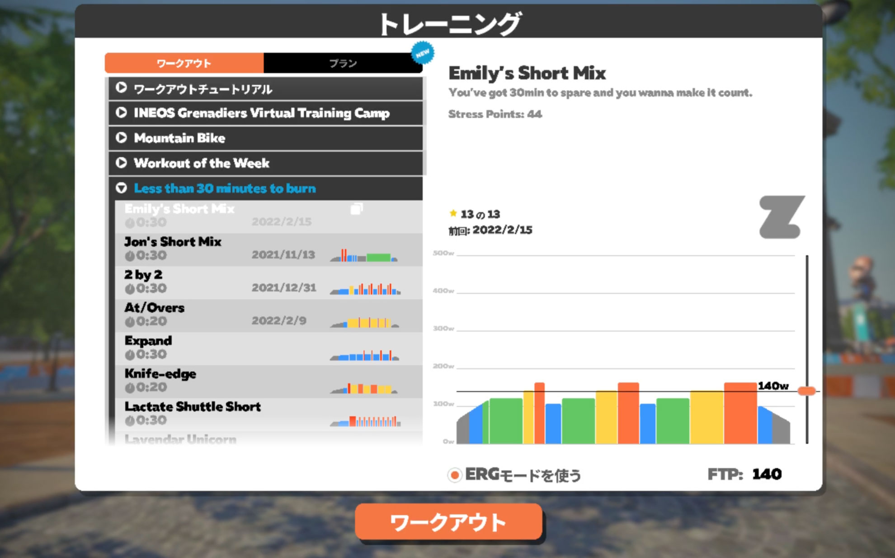
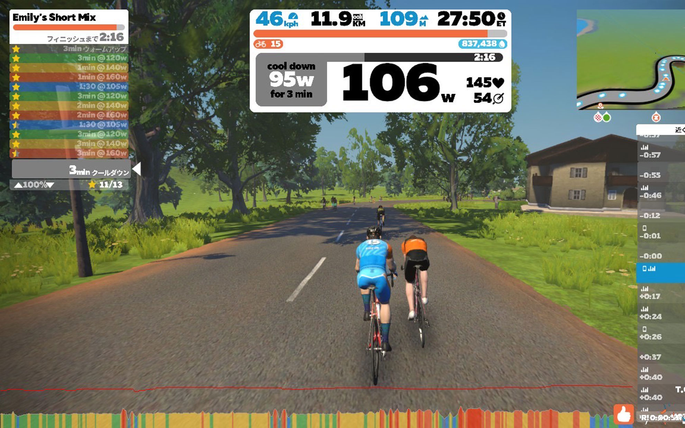

お手軽な達成感が長続きします。    
<!--more-->
　  

### ダラダラ走るのは飽きる。
　ZWIFTの短いルートはだいたい走り切ってしまい、あとは長距離を走らないとバッジが獲得できないようなルートや、獲得標高が結構高くてキツいルートを現在走っています。それでも１時間くらい走ると疲れてくるより前に飽きてきてしまい、完走できない時があります。なんという軟弱な精神・・・。  
　それでも運動はしたいし、達成感がほしいと思うのであれば、トレーニングがおすすめです。  
メニュー画面からトレーニングを選択、ワークアウトの種類を「Less than 30minutes to burn」を開いてみると、20分から30分の間で効率的にトレーニングできるメニューが並んでいます。まだ全てはトライしていないのですが、個人的に「Emily's Short Mix」と「2 by 2」がオススメです。
ケイデンスを徐々に上げていき、限られた時間の中で高ワットで頑張るのを繰り返すのですが、意外に時間があっという間に過ぎていくのでトレーニング終了時には心地よい達成感と汗でちょっと楽しい。  
　トレーニングは目標となるワット数とケイデンス数に近づけるのが主な内容で、ペダルを踏むのが強過ぎても弱過ぎてもダメで、ケイデンスが早過ぎても遅過ぎてもダメです。メニューは細かいセグメントに分かれていて、例えば120wで3分間などの条件をクリアすると星マークがもらえます。全てのセグメントに星がつくと最後の総括画面で「OK!」とおじさんからお褒めの言葉をいただけます。今日はスクリーンショットとか撮ろうと思って操作を雑にしていたらペダリングが乱れまくって星を一つ欠いてしまい、OKを貰えませんでした・・・。  
　  
それでも短時間でやりがいがあるメニューを用意してくれるのは嬉しいです。未プレイの方はぜひお試しください。  
　  　  
  
  
　  
  
  
  