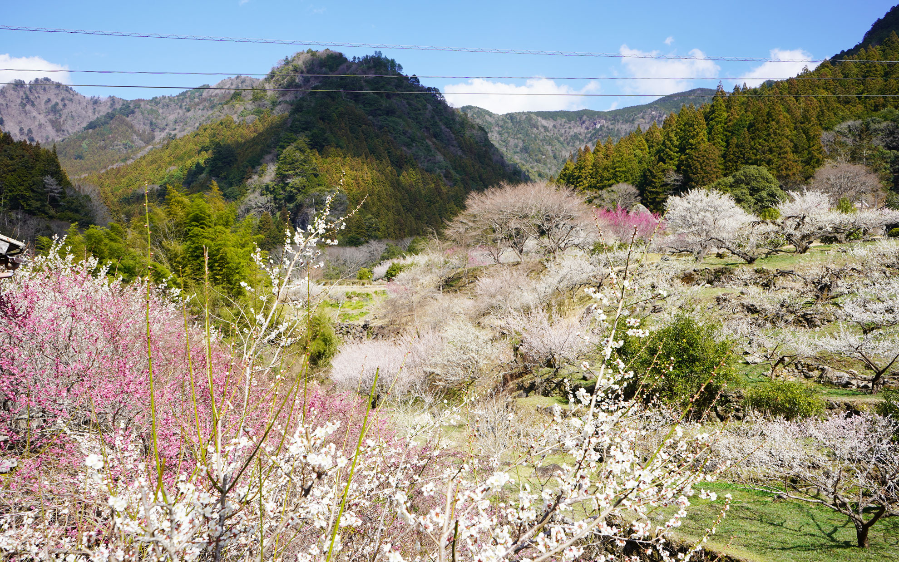
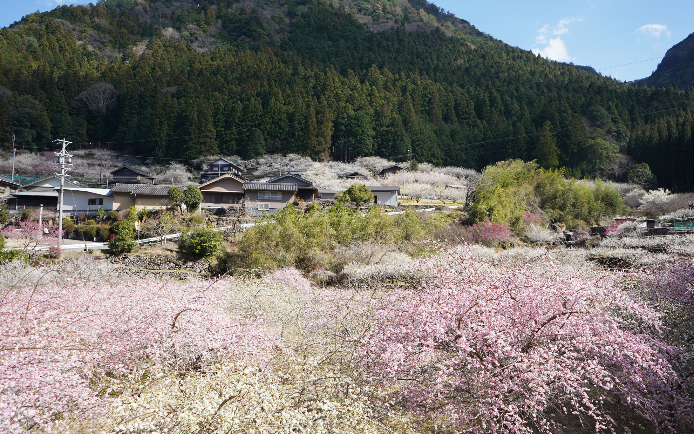
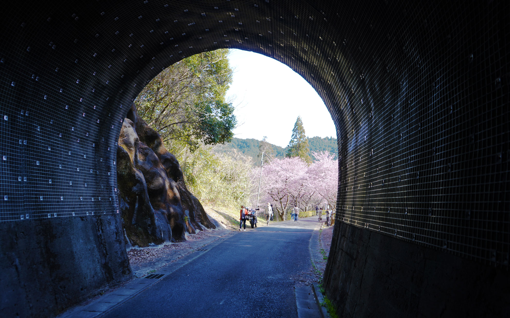
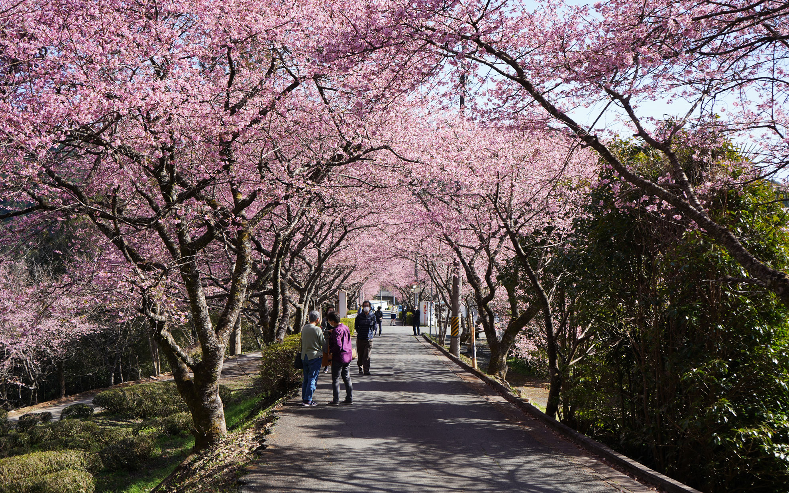

どちらもちょうど満開で見頃を迎えました。    
<!--more-->
　  

### 一気に暖かくなりましたね。
　新城市の川売（かおれ）地区にある梅が見頃と聞いて、見に行ってきました。先週末はまだ咲いている花も少なかったそうですが、ここ数日の暖かさに一気に蕾も開いてきたようで、訪れるとマスク越しでも梅の良い香りがします。数年前からここの梅を見にきているのですが、いままでで一番綺麗な時に来られたかも・・・。  
　  
　帰り道に玖老勢から鳳来寺を抜けて本長篠の河津桜も見に行ってきました。こちらもちょうど満開とあって、多くの人が桜を楽しんでいました。どちらも自転車で巡るにはちょうどいい距離にあるのですが、花粉シーズンも本番になってしまい目と鼻が大変辛いです。そろそろ花粉症対策に本腰を入れるほうがいいかなぁ。舌下療法とか気になっています。
　  　  
  
  
  
  
　  
