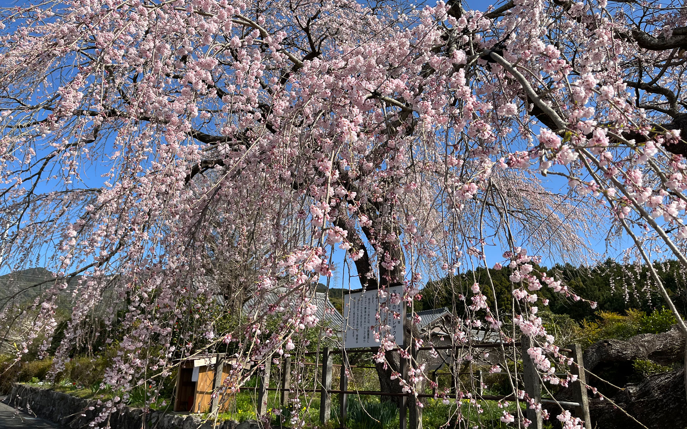
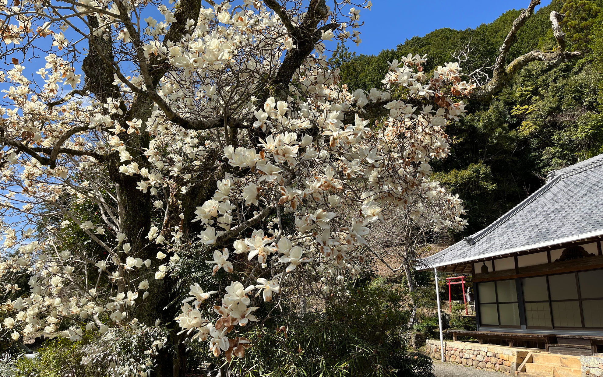
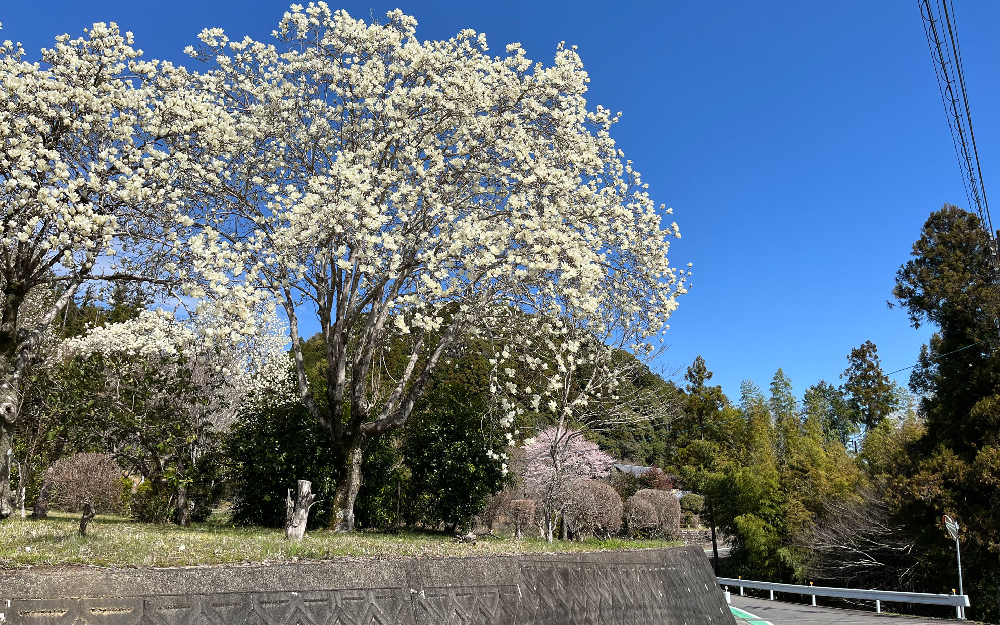
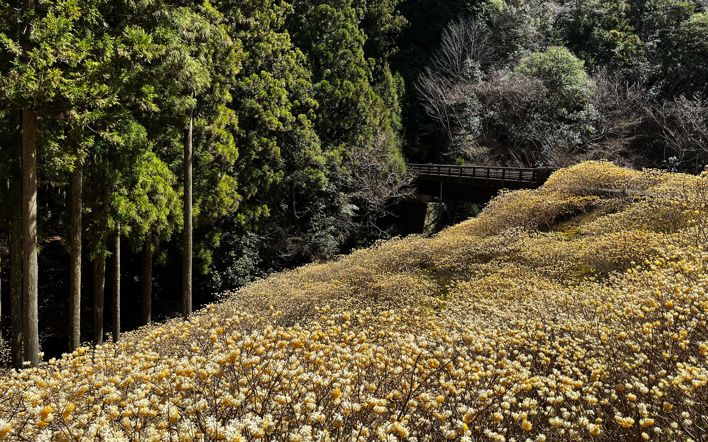
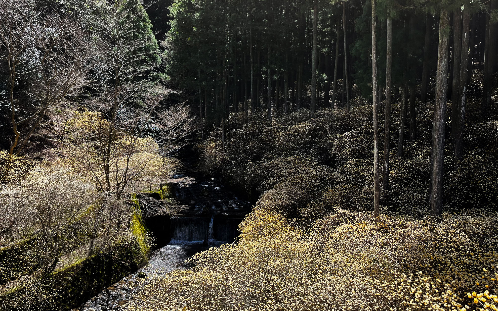

お休みに花を愛でにお出かけしてきました。  
<!--more-->
　  

### 知らなかった花の名所にも行ってきました。
　豊川市の宝円寺にある枝垂れ桜は昔から知っていたので、毎年見るのが楽しみで自転車で見に行ったりしていましたが、今年は新城市の大徳寺のモクレンと巴川から少し入ったところにあるミツマタの群生地にも行ってきました。  
　どこの花もちょうど見頃のようで、運が良かったです。大徳寺のモクレンは広い敷地に咲いていて、白い花弁がまさに仏教的に感じられて、ありがたくも感じました。お寺の敷地内にありますが拝観させていただけます。多くのモクレンが咲いていますが、境内の一本のモクレンから株分けしたものらしく、立派に育っていました。  
　数年前の新聞かSNSで知ったミツマタの群生地は、自転車でサイクリングする巴川のよく走る道から少しそれた先にありました。写真では伝えきれないのですが、とても広大な範囲にミツマタが群生しており、それが甘い匂いを醸し出して黄色い花を咲かせています。自分達も含めて多くの人が楽しんでいましたが、薄暗い朝に一人で突然この風景に出くわしたら少しゾッとするかもしれないくらい神秘的にさえ感じました。  
　　　　  
　毎年春あたりになると調子が悪くなったり、気分が落ち込んだりすることもあるのですが、こうして花が今年も咲いているのを知るとやがて自分の調子も戻っていくんじゃないのかなと少しだけ楽観的になれたりします。いろんなことがあっても、誰にも知られなくても花は毎年咲いていくように、自分も花が咲くようにありたいと思いました。  
　  　  　  
  
  
  
  
  
 
　  
