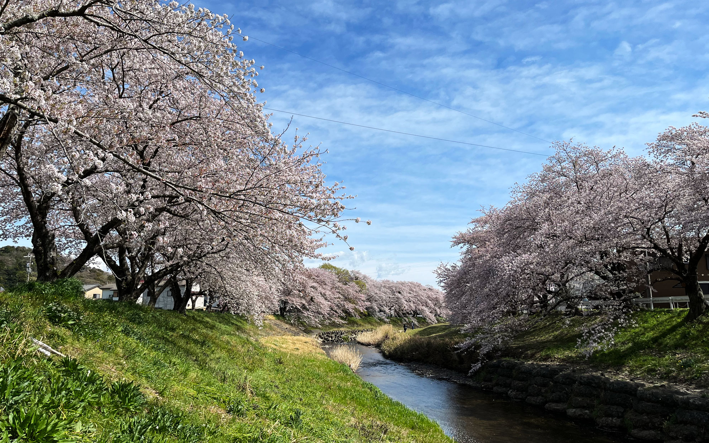
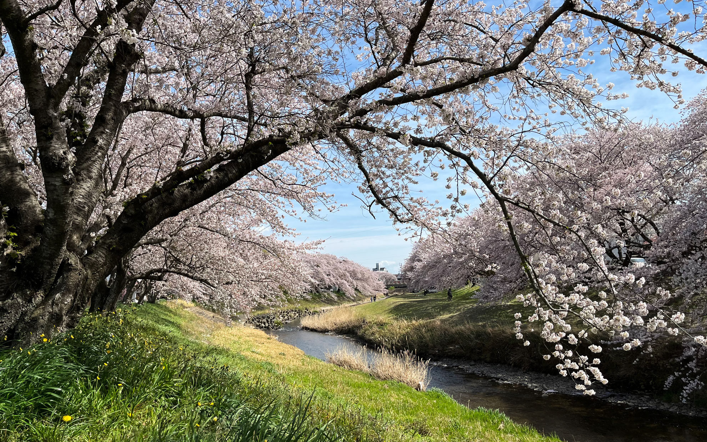
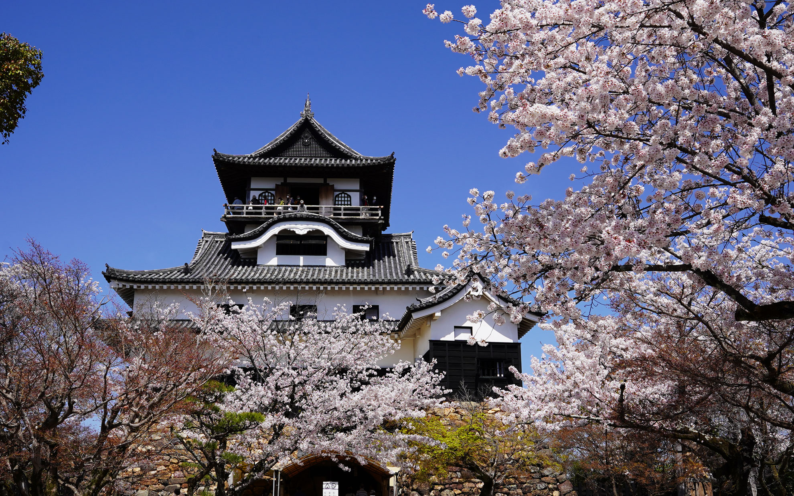
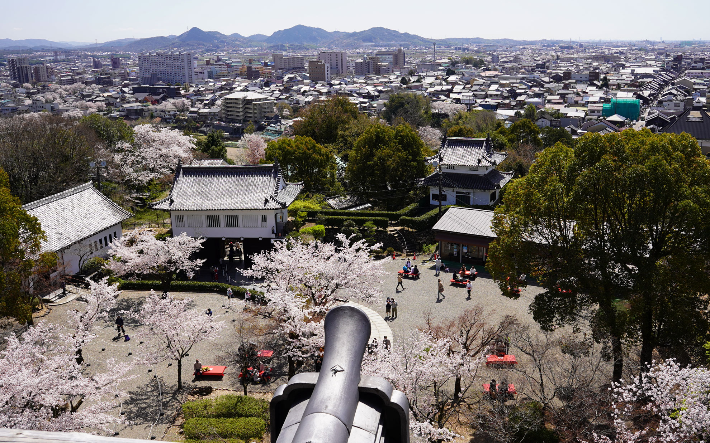
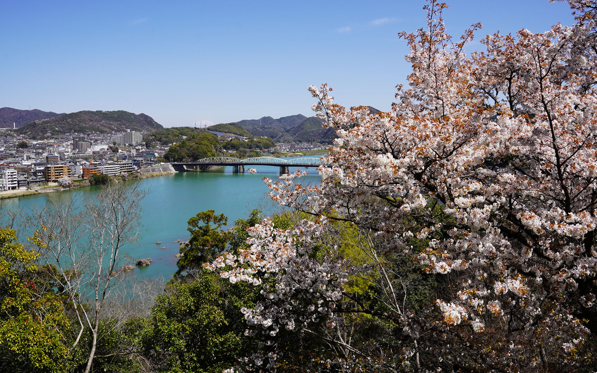

日本は桜の名所が多すぎる。  
<!--more-->
　  

### 豊川市の音羽川堤防の桜
　豊川市の西部を流れる音羽川には昔から綺麗な桜が咲いていることで有名でしたが、なにぶん昔の街道筋にあって駐車スペースがなかなか無いので桜シーズンに見にいく機会があまりありませんでした。（僕は自転車で行こうと思えば行けるのにね）  
　最近駐車場が整備されたという話を聞いて、時間を見つけて桜を見に行ってきました。豊川で有名な佐奈川は人工の川で一直線に流れていて、堤防沿いに桜が咲く様は美しいのですが、音羽川の自然な流れに沿って桜が咲く様も大変きれいでした。  
　　  
### 犬山城の桜  
　お休みをいただいて平日に犬山城へ行ってきました。平日というのにすごい観光客の多さで（自分も含む）、お城だけでなく城下町の商店街もたいそう賑わっていました。初めて犬山城に行ったのですが、城下町が若い層の人たちに人気らしく、おしゃれなカフェやお店が多く、みんな楽しそうに春の犬山を楽しんでいました。  
　犬山城の天守は急な階段をヒイヒイ言いながら登って最頂部では外の柵をくるりと一周まわることができたのですが怖すぎる。特に鉄製の柵などで補強してあるわけではなく、江戸時代から続くナチュラルな木の柵だけで（それを言ったら天守自体江戸時代のまま）、国宝を維持しながら観光客に開放しているのは凄いなぁと何気に思ってしまいました。それにしても天守からの眺めは美しく、遠くは名古屋まで見通せる立地はこの城の重要性を身をもって知らしめてくれました。  
　  
　どちらも桜は満開で楽しめました。知らなかった場所をこうやって新しく触れる機会があると嬉しいですね。  

  
  
  
  
  

