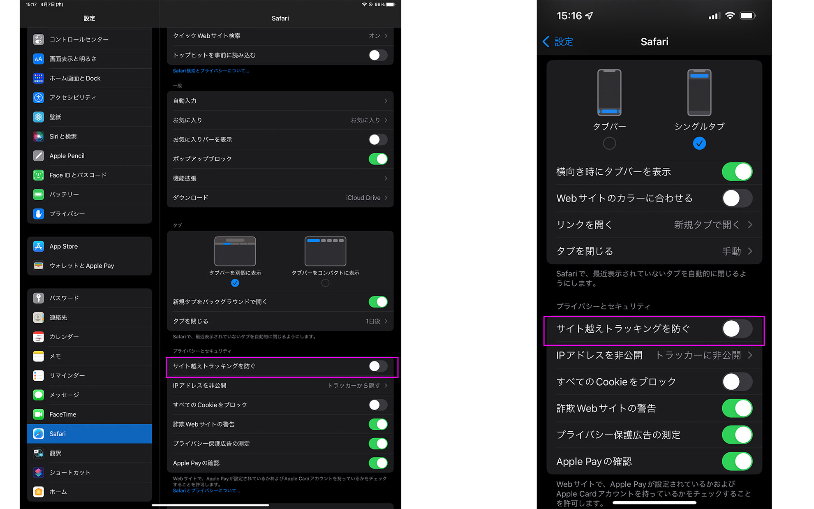

コメントでエラーが出る場合の対処法についてのお知らせです。  
<!--more-->
　  

### PCのChromeでは動作したのですが
　iPadOSならびにiOSのsafariでTwitterアカウントにログインをしてコメントを入力してもエラーが出ることがわかりました。理由はsafariの設定で「サイト越えトラッキングを防ぐ」を有効にしているからです。別タブでせっかくログインしてもサイトを越えてトラッキングができないとログイン情報をコメント機能に受け渡すことができなくなるためエラーが出るそうです。  
　  
　対処方法としては、設定→safariから「サイト越えトラッキングを防ぐ」をオフにしてGoogle、Facebook、Twitter、disqusのいずれかのアカウントにログインをし、（無い場合はお手数ですが新規でアカウントを作成してください。）コメントしていただければ幸いです。  
MacOSのsafariも同じ原因でエラーが出ます。環境設定→プライバシーから同じく「サイト越えトラッキングを防ぐ」をオフにしていただければコメントができるようになります。コメントをご希望される方は設定していただければ幸いです。
　  
もっと早く気が付くべきだったのですが、自分の環境でテストをして満足してしまったため遅くなってしまい誠に申し訳ありません。  
　  
  

