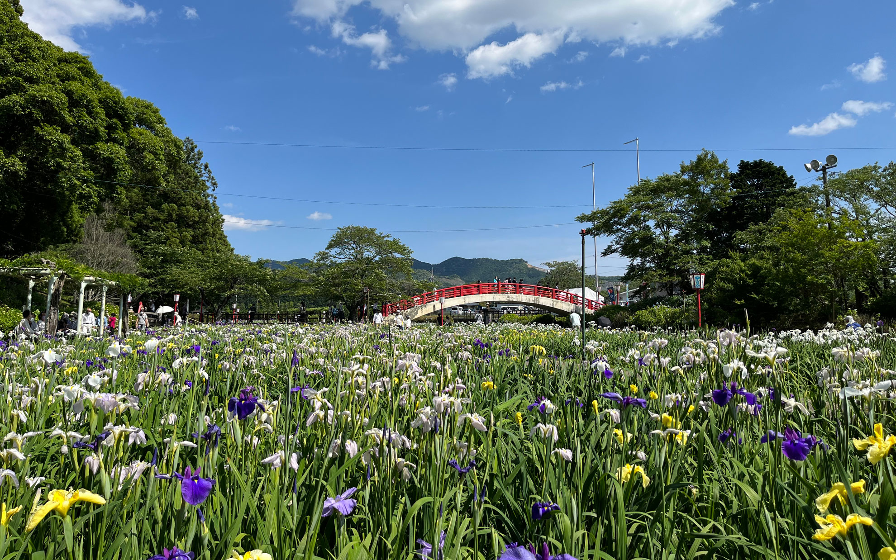

加茂の菖蒲園に行ってきました。  
<!--more-->
　  

### もう菖蒲の季節
　ここ半年以上のあいだ精神的に調子が悪くて、それでもお出かけしたりする余裕はあったのですが、4〜5月はちょっとそういう余裕も無くなってしまって家で寝込んでいる日が続きました。梅が咲いて桜の花も綺麗な花を咲かせた春からあっという間に梅雨の入り口に入ってしまい、季節がぼーっとしている間に凄い勢いで過ぎ去っていく感じで、落ち込んでいる暇もありません。  
 　  
今日は加茂の菖蒲園へと出かける気力があったので家族で見に行ってきました。気温はすっかり初夏を迎えているような暑さですが、まだ湿気がないので菖蒲園をサラサラとした気持ちいい風が吹いていて、歩いていても快適でした。  
これで少しは外出できるようになったから調子も戻ってくれるといいな。
　  
  

