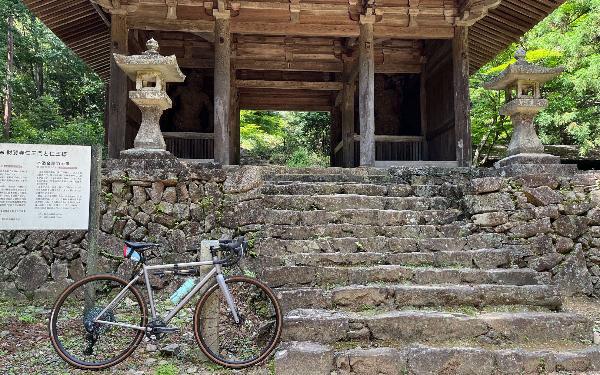

もう梅雨明け？ 本当に？
<!--more-->
　  

### すっかり夏が到来です。
　梅雨の晴れ間に自転車に乗ろうと思って晴れたら梅雨明けだった・・・。もうこのまま真夏になるんでしょうかね。  
 　  
今日は近所の山を軽く走ってきました。風はまだ気持ち涼しく感じる程度ですが、日差しが厳しいです。山の中は日陰も多いですがそれほど涼しくはないですね。できるなら早起きして自転車に乗ってみたいものです。  
　  
  

