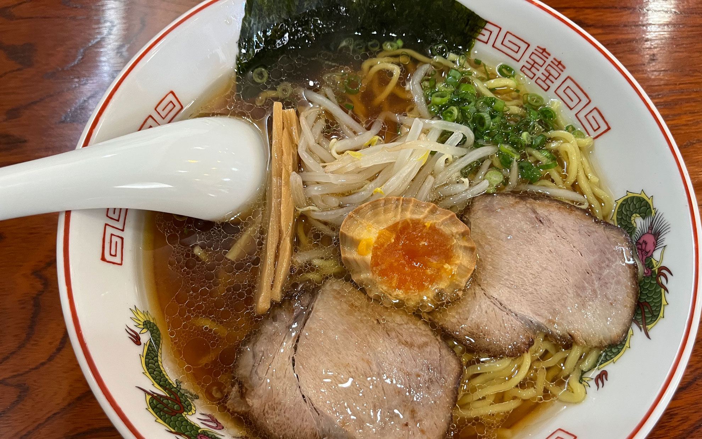

今度こそ本当の梅雨明けっぽい天気です。
<!--more-->
　  

### 入道雲の白さが夏を感じさせます。
　6月末に梅雨明け宣言が出たものの、「戻り梅雨」というので雨ばかりの天気でしたが、ようやく晴れてきました。  
 　  
と、天気が良くなれば気温も物凄く高くなり、暑さになれていないので夏場のサイクリングは厳しいです。家に閉じこもっていても仕方ないので、今日はお出かけをしてきました。どこの風景もしっかりと夏を迎えていて、個人的に真っ白で大きな入道雲を見るのが好きなので、夏を満喫できたような気がします。  
　  
  

