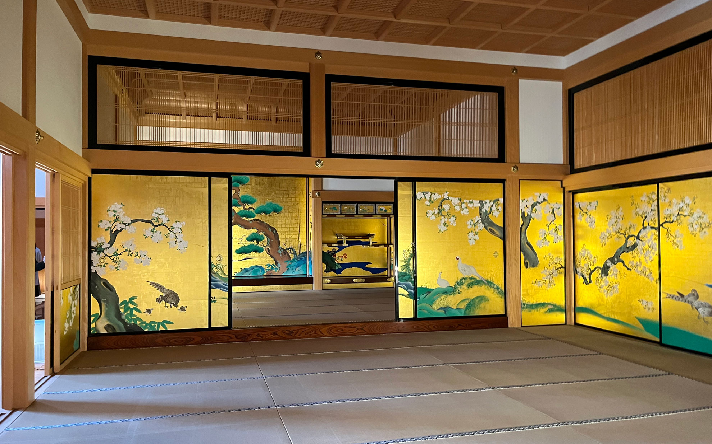
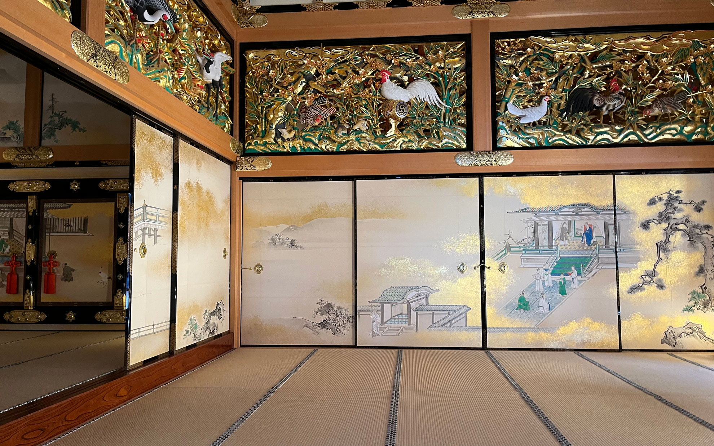
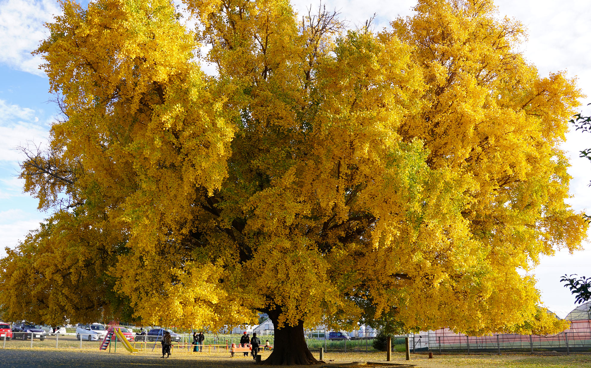

気がつけば今年も終わりですね・・・。
<!--more-->
　  

### 自転車通勤しています。
まだ体調は本調子ではないのですが、自転車で通勤するのが気持ちいいです。  
 　  
去年の10月くらいから体調が悪くなってしまい、なかなか良くならない日々が続いています。  
病気になってから今年で16年経つらしく、自分のことなのに実感があまり湧いてきません。  
今年は特にブログの更新もできないまま一年が経ってしまい、去年までは続けていた勉強もいつの間にか辞めて、何かを得るわけでもなく何かを発信するわけでもない、自分的につまらない年になりつつあります。それではいけないと気持ちだけが先走るものの、どうにもならないものはどうにもなりません。  
少しずつでもいいので、調子が戻ればいいな。  
最近はそんな中でも少し外出してきました。名古屋へ用事があって出かけたついでに名古屋城の本丸御殿を見学してきました。太平洋戦争末期の空襲で天守閣とともに焼失した本丸御殿が造られた当時の工法で緻密に復元されております。襖絵や装飾は煌びやかで大変美しく、装飾の幾何学的な模様は現代的にも感じられて感動しました。戦争で焼失した文化財は多いと思うのですが、このように復元された建造物を見ると他の建造物も復元したものを見てみたくなりました。  
今日は大和の大いちょうを見に行ってきました。午後3時だというのに夕日のように陽が傾いていて、冬の到来を否が応でも感じさせられましたが、今年もこの大木の迫力がある様子を見ることができたのでよかったです。  
色々ありますが、焦らずぼちぼち頑張っていきたいと思います。  
　  
  
  
  

