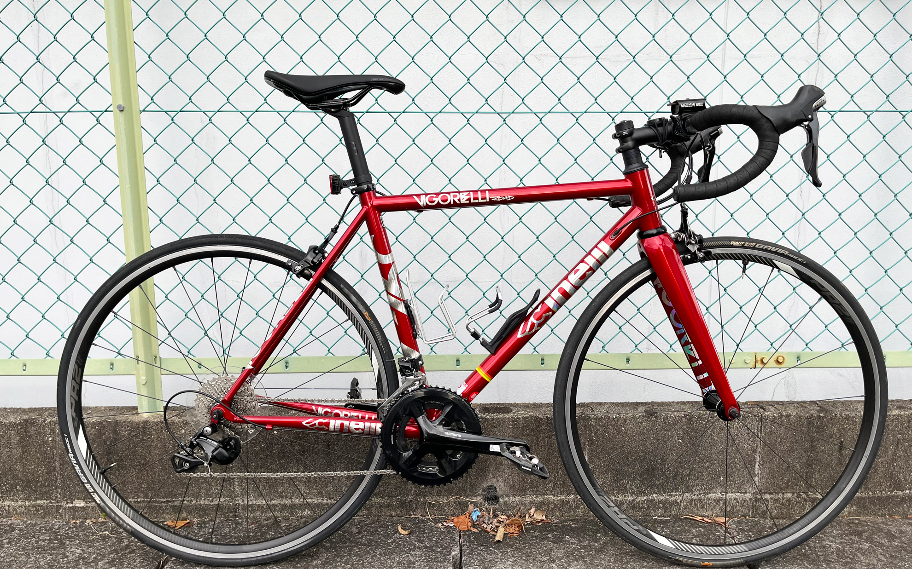
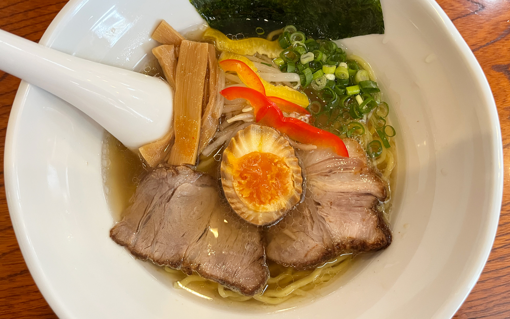
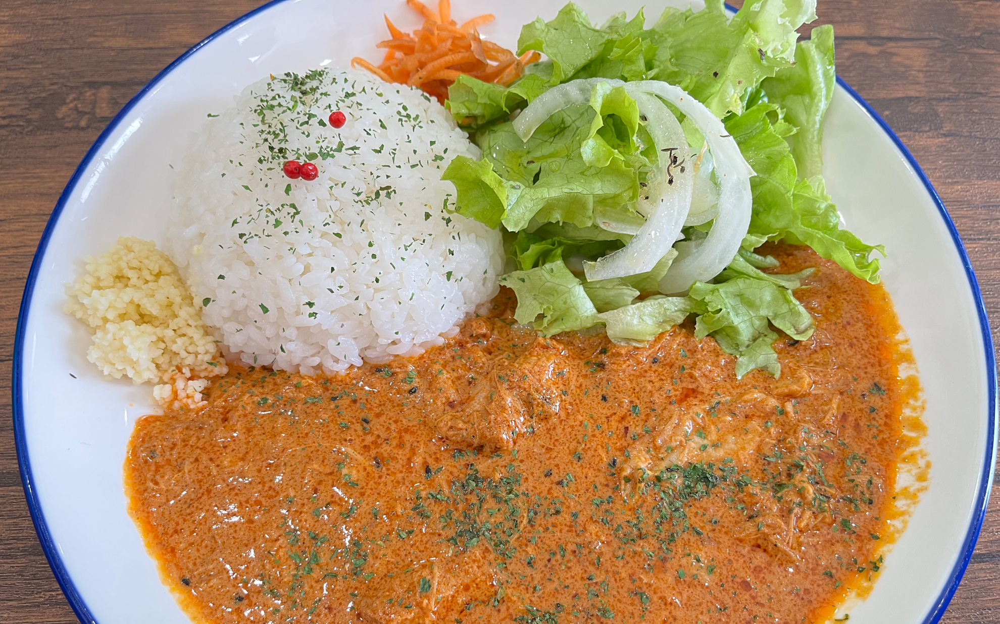
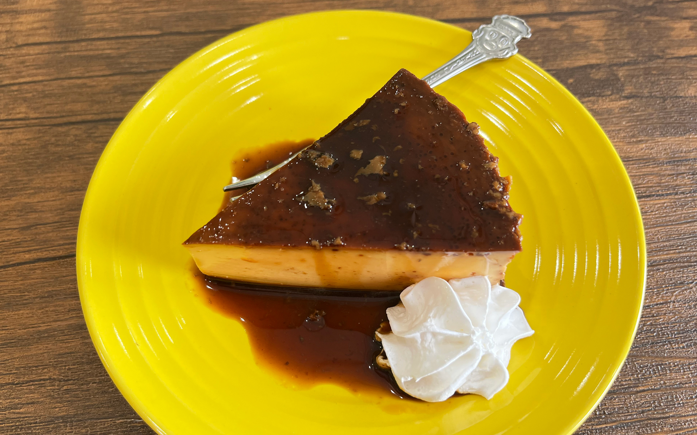
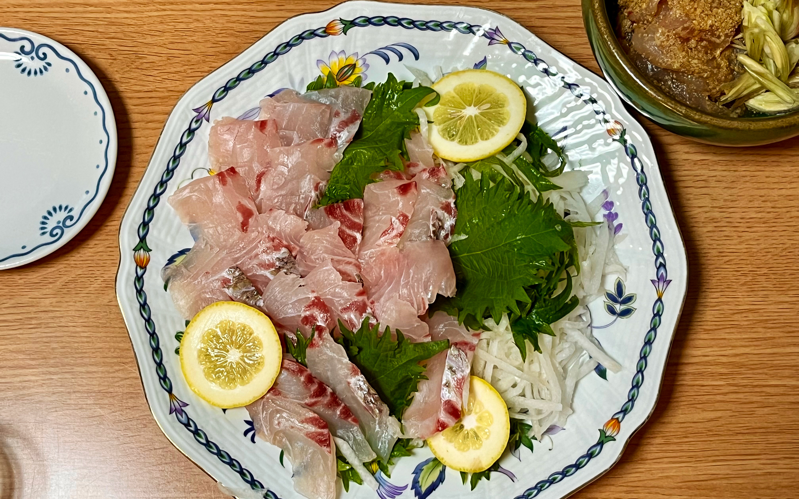

生きていますよ・・・！！
<!--more-->
　  

### 今年の記憶があまりない。
前回の更新から早くも9ヶ月が経ちました。皆さん、お元気でしょうか？　僕はとりあえず元気です。日々の仕事に追われて週末は疲れ切って寝込むことは相変わらずです。諦めずにマイペースで頑張ろうと思います。  
　  
とはいいつつも、2023年を振り返ってみると大した記憶もなく、写真フォルダを見返しても仕事で参考にするために撮影したものが多くて、他には食べ物くらいしか残っていませんでした。よく覚えていると言えば、夏休みにはコロナにかかり、高熱に襲われたことでしょうか。熱は39.9度まで出て意識が朦朧としたのですが、それより辛かったのは喉の痛みです。唾を飲みこむのさえ痛くて一晩は眠れられなかった記憶があります。コロナの症状は個人差があると思いますが、かからないに越したことはないので、皆さんくれぐれもお気を付けてください。

通勤用の電動ママチャリは、楽ちんで罪悪感を感じつつも、電動アシストのおかげで快適です。思ったのは充電が月に１回くらいで十分だということで、かなりコスパが良いです。ブリヂストンのママチャリタイプなのでめちゃくちゃ重いし、見た目はオーセンティックかつトラディッショナルなママさん自転車なのは避けられない事実なのですが、それでもスポーツ車を出しているメーカーのカッコいい電動自転車の価格に比べればかなりお値打ちです。おすすめしますよ。  
　  
最近父が自転車のフレームをジャイアントからチネリに乗り換えました。「ヴィゴレッリ」というリムブレーキ対応のスチールフレームですが、かなりカッコいいです。確かトラック競技用のフレームの名前だったような気がしたのですが、ロード用のスチールフレームも作っていたんですね。以前父が乗っていたのはアルミフレームなので重量は重くなってはいますが、ポタリングをするのには気にならないですし、ギヤも大きいものが付いているので軽い走り心地です。見た目の大幅なグレードアップに父はモチベーションがアップしたようで、最近は冷房をかけながらZwiftもやっています。僕より自転車にハマってるな・・・。
  

### にんげんごぢうねん
いまだに受け入れ難い事実なのですが、今年で50歳になるわけでして、今まで何をしてきたっけ・・・としばしボーゼンとすることもあります。よく50歳になると話題になる「敦盛」によれば、もともとは人間の寿命が50年と歌ったわけではなく、人の世の50年なんか天上界の人々の人生（8,000年）に比べれば夢や幻のようなものだと例えたのがそもそもの意味だったとか習ったような気がします。天上界の人たちと比べられてもなぁ・・・。
 
　  
### おいしいは凄い
今年の記憶がないとは言いつつも、美味しいものを食べると多幸感に包まれます。外出して食事をするときは少しでも写真を撮っておこうと思いました。あとで写真を見返すと、その時の満足感が記憶と共によみがえります。写真を撮るって結構大切なんだなぁと改めて痛感しました。ブログのエントリーも後で読み返すと文章を作成していた時の記憶や付随する関係ないけど大切な思い出がリンクして脳に浮かびます。
自分はアナログな人間なので、何かしら写真やログを残しておいて、過去の思い出を反芻しながらも今後の人生が豊かなものになるようにありたいと思う次第です。
ブログはまだ諦めないで投稿するつもりですので、お付き合いいただける方は今後ともよろしくお願い申し上げます。

  
  
  
  

