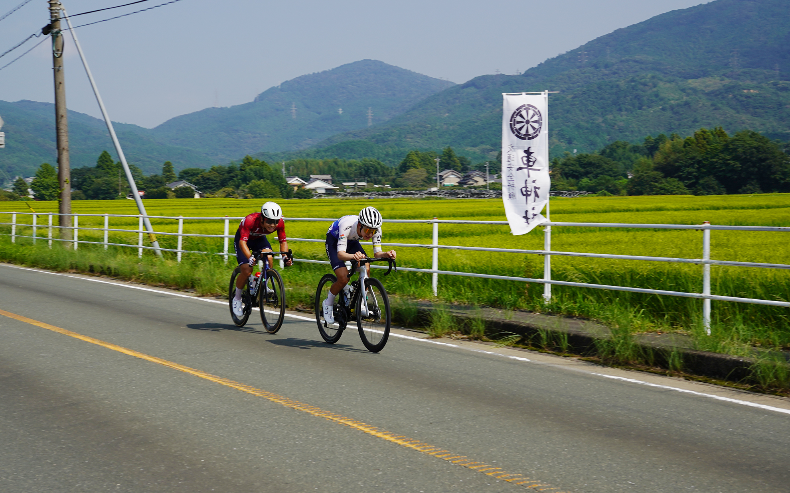
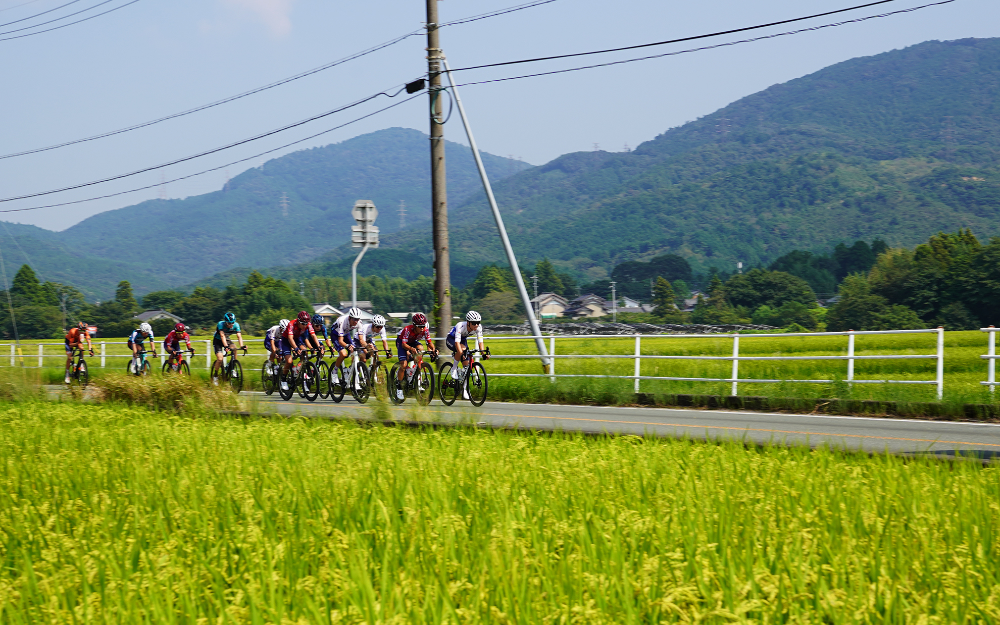
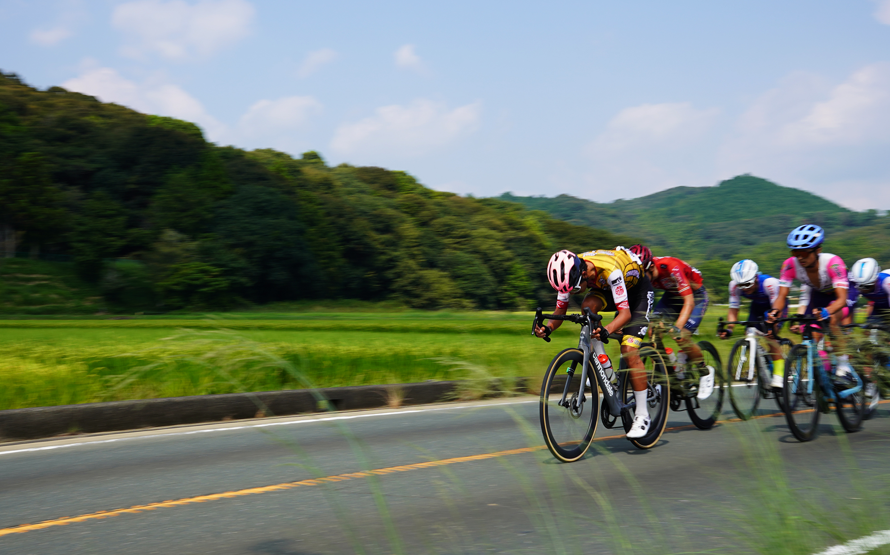
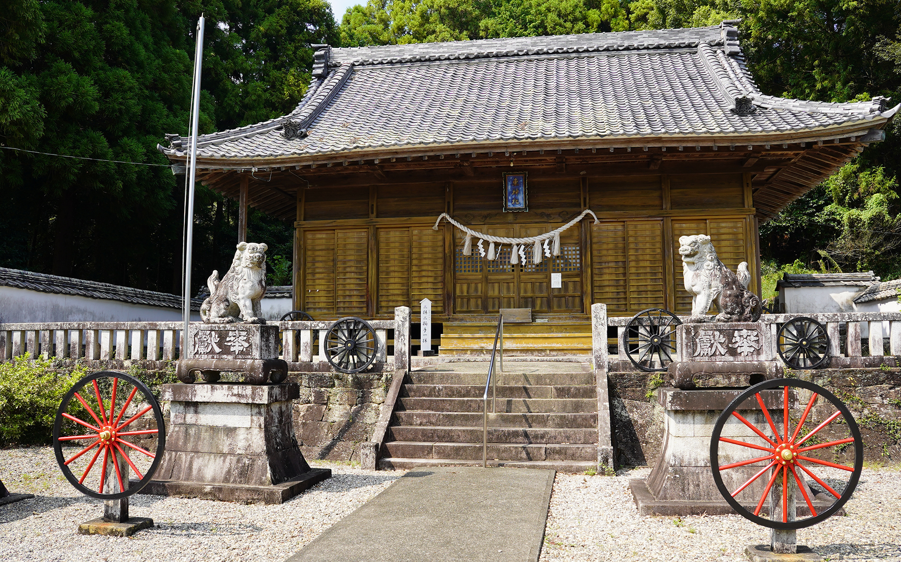

新城で公道ロードレースが開催されたので観戦してきました。
<!--more-->
　  

### 今年の記憶もあまりない。
ああヤバイなぁと思いつつも振り返ってみる余裕もないまま今年もあと3ヶ月を残すところとなりました。今年は年明けに1ヶ月ほど休職して、さらに年度明けにも更に1ヶ月ほど休職し、職場の皆さんに迷惑をかけてしまいました。
　  
記録を残すことはやはり大切で、とりわけ自分の脳という記憶装置は不可逆的にスペックが低下しているので、外部記憶装置たる何らかしらの媒体に頼らざるを得ないわけです。この年齢になって、ようやくノートにメモを取るというのが大切だと気がつき、仕事ではメモを読み返すことで案件ごとの時間軸の記憶を思い出すのに役立っています。ただ、なぜそれを自分の人生にも活かせないのか疑問です。

### ロードレースを観戦
今日は新城市で行われたJBCF新城ロードレースを見に行ってきました。新城市は2026年開催のアジア・アジアパラ競技大会のロードレースの会場にもなっていて、サイクルスポーツの普及に長い間熱心に注力している自治体です。地元で公道を閉鎖してのロードレースが見られるとは思ってもいなかったことで、実際に選手が目の前を走り抜けると自然と興奮してきます。
　  
コースは桜淵公園をスタートして、吉川から桧峠を登り、富岡の田園地帯の直線道路を走ったあとに横浜ゴム新城工場の横を走って再び桜淵公園に戻る周回コースで、16kmを10周するコース設定だそうです。むかし走ったなぁ。また走りたくなりました。峠から降りて平坦なストレート区間で見学していたので、あっという間に選手は走り抜けてしまいましたが、何しろ目の前で走るので、選手の表情や力強いペダリング、息遣いやロードバイクのエアロホイールの独特な音が伝わってきて、やっぱり自転車はいいなぁと思ったのでした。

### 車神社でお詣り　  
ちなみに観戦したのは車神社という富岡に昔からある神社で、境内にはホイールが鎮座しています。涼しくなったら自転車に乗る元気がもらえるようにお祈りしてきました。周りの田んぼは稲穂が黄金色になり始めていて、神社の境内を抜ける風は涼しくて夏も間もなく終わりそうな気がしてきました。美味しいもの食べて自転車を楽しみたいと思います。

  
  
  
  
