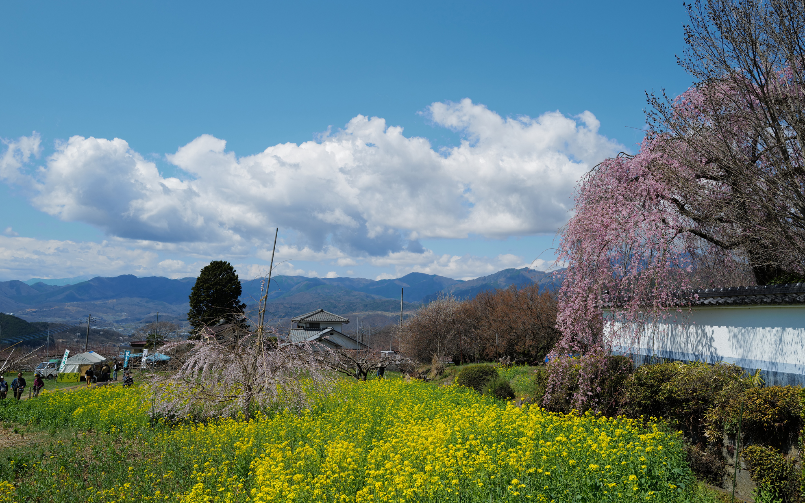
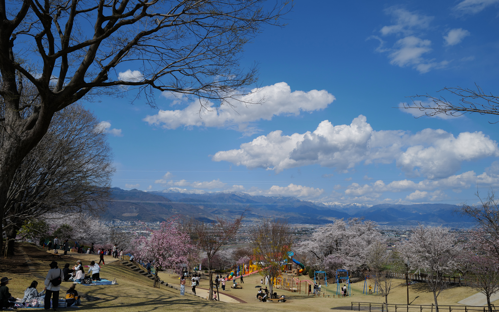
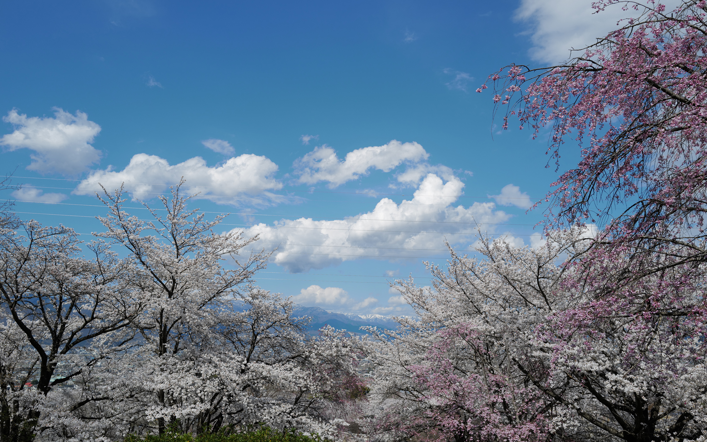
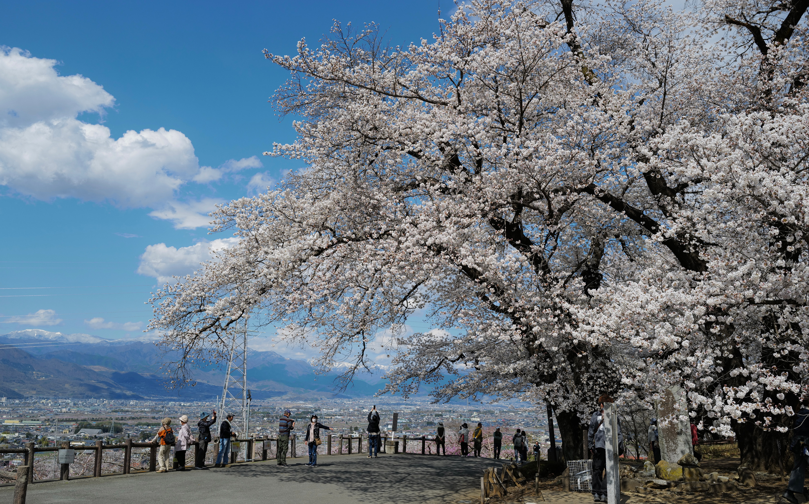

年１回更新のブログではないのですが…。
<!--more-->
　  

### この３年の体調が良くないかんじ。
最近、あの時何をしていたか振り返ることがあるのですが、この3年は体調が良くないようで、とりわけ2023年から仕事を休職するのを繰り返していました。休みのあいだにリフレッシュしようと外出したりする元気もなくなってしまい、家でひたすら寝込んでいる時間が増えたように思います。
　  
このままでは良くないと、精神疾患に特化した訪問看護を受けるようになりました。看護師さんが自宅に来てバイタルチェックや服薬指導のほか、お話を聞いてくれます。何かしらカウンセリングをしてもらうというよりは日常で起きたことや仕事の愚痴など話し相手になってくれる感じです。普段の環境とは違う人と会ってお話ができることで日常にも変化が出てきました。休みの日とはいえど、パジャマで応対はしたくないので身だしなみを整えて、看護にいらっしゃる時間に間に合うように起きるので休みの日でも寝たきりじゃなくなったりして、生活のリズムが良い方向に向いてきた気がします。仕事とはいえ、こんなおじさんの話を聞いていただいて看護師さんには感謝しています。

### 今年の桜は
先日は山梨県の桜を見に行ってきました。新東名の新清水JCTから中部横断自動車道経由で行けるようになったので、運転は非常に快適になりました。むかし、ほったらかし温泉へ日帰りで入浴に行ったときは新清水から下道で行きましたが、結構道のりは長くて大変だった記憶があります。今回は桜を楽しんで町中華の正統なチャーハンを食べてゆっくりと時間を過ごすことができました。リニアもチラ見できたし、こんな休日をもっと過ごすことができるようになったら楽しいだろうなあ。

### 春のクラシック　  
自転車に乗る体力は回復していないものの、春のクラシックレース観戦はオンデマンドで楽しむことができています。今年もと言うべきかポガチャルの凄さは異次元で、変な笑みがでてきそうなくらい強い。でもポガチャル一強ではないのがさらに凄いところで、アムステルゴールドのように番狂わせも起きたりします。女子レースも本格的になってきてロードレースがヨーロッパでは本格的に盛り上がってきているように感じます。7月にはツール・ド・フランスが開催されるのでフランスに行けたら観戦ついでに旅行してみたいところです。まずは毎日元気に仕事をして週末も遊べる体力が欲しいな。

  
  
  
  
