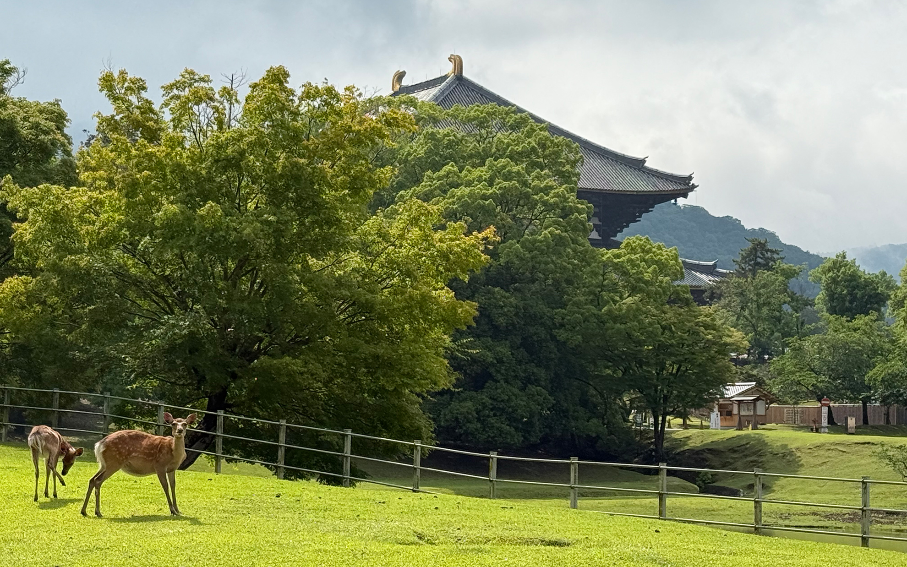
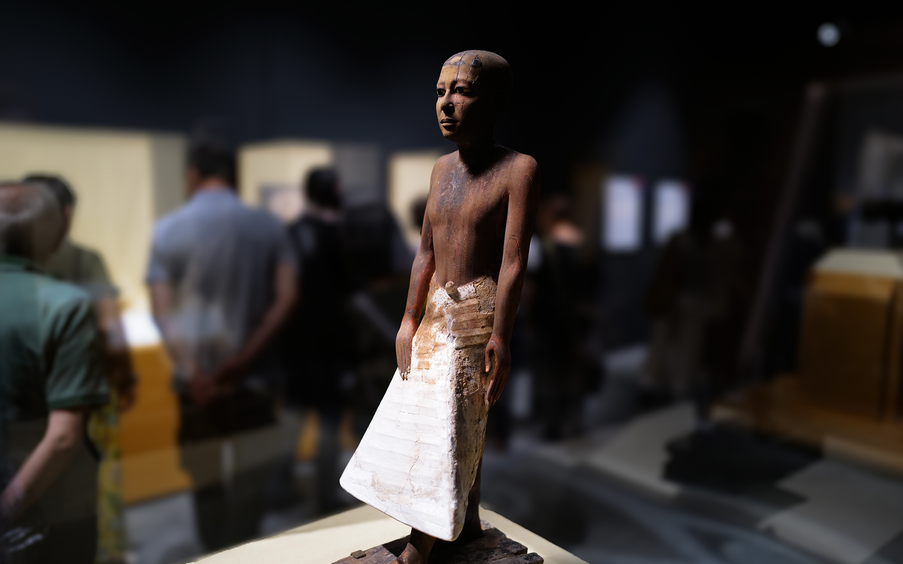
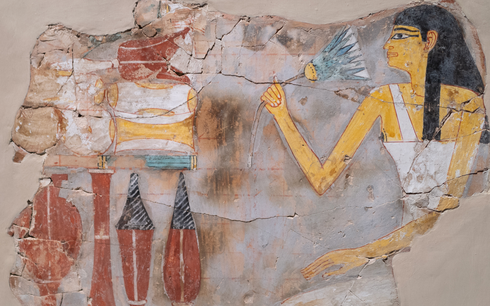

元気がないお年頃？
<!--more-->
　  

### 今年の半年は夏でした。

　年一回の更新は避けたいと思いつつも、夏が過ぎようとしているのに気がつき慌てて備忘録のようにこのブログ記事を書いている今日この頃、皆様におかれましてはいかがお過ごしでしょうか。ここ数年は夏が5月から10月までの１年間のうちの半分を占めるようになりましたね。
　  
　相変わらず元気が出ないまま休みの日にはベッドから起き上がるのも億劫で、夕方5時に「夕焼け小焼け」のメロディーと共に「早くおうちに帰りましょう」と近所のサイレンから鳴る頃にようやくモソモソと起きあがり、外出した実績解除をするためにコンビニへ出かけてコーヒーを買ったところで休日は終了。そんな生活が3年くらい続いています。  
「元気があれば何でもできる！」というのは思うに名言で、逆に元気がないと本当に何もできないですね。元気がほしい・・・。  
　
### 体力があるときは出かけよう。  
そんな体力が少ないなかでも諦めずに、無理のない範囲で美味しいものを食べに行ったり、小旅行へ出かけたりしました。  
今年は「超！国宝展」が奈良で開催され、京都と大阪でも同時に展示会があったので１泊２日で大阪と奈良へと出かけました。  
教科書などで見たことがある仏像や絵画ばかりが空間に濃縮されて展示されていたので、かなり圧倒されました。奈良の正倉院展とは違って、作品の時代背景は様々ですが総じて今まで残っていたことが凄いことと、実物はやっぱり絵画であっても伝わってくるものが全然違うなと会場でひたすらに唸っていました。保管方法や全国から集めるのは大変だとわかっていますが、毎年とは言わないけど５年に１回くらい展示してほしいな、と思いつつ図録を買いました。今年も開催予定の正倉院展にはぜひ行きたいです。  
  
  
  
　  
　ブルックリン博物館収蔵のエジプト展が東京、静岡と経て豊田市にもやってきました。トヨタ自動車様のおかげで家から近いところで見られるのはありがたい。  
　このところYoutubeで名古屋大学のエジプト考古学者である河江教授の動画をすべて履修してきたので、展示品の説明が脳にガツンと直球で入ってきます。事前学習してから見ると解像度が全然違うのは、フランスで留学中に美術史を習ってからルーブルやオルセーなどの美術館に行った時に経験していますが、今まで知らなかった古代エジプト人の生活や死生観などを覚えてから見学すると多くの情報が凝縮した状態で理解できて若干ハイになりました。  



  
  

エジプトに行きたくなってきたなー・・・。  
### 自転車は今も好き。
　こうやって体力があるときは、自分の興味があることに全振りしていきたいですね。ロードバイクはあいかわらず乗れていないのですが、今年は春のクラシックからジロ・デ・イタリア、ツール・ド・フランスをオンデマンドで後追いしながら見ていました。SNSは見ないようにしてネタバレを防止して見ているのですが、やはりというか今年はポガチャルの年になり、「まさか今回も単独逃げにはならないだろうな・・・」と思っていたレースもかなり手前からのアタックがあって、予想を上回る活躍ぶりでした。というか漫画でこんなシナリオを描いたら編集者に却下されるんじゃないかな。それでもツールの最終ステージはこれまた予想外の展開で本当に面白かったです。もう毎年最終ステージはパリ市内を周回してほしいなぁ。モンマルトルだけじゃ単調なので、メニルモンタン通り（Rue de Ménilmontant）とかパンテオンあたりも坂道があるので検討してほしいです。来年こそは見に行きたいなー。