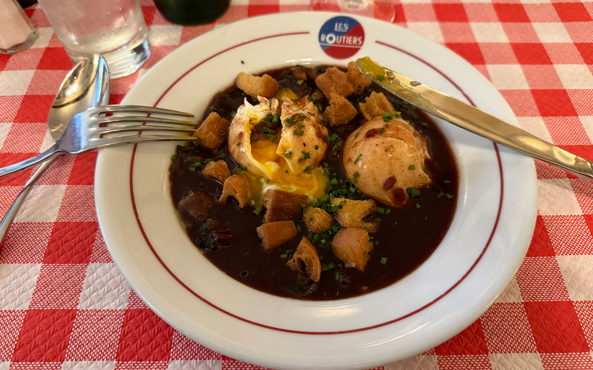
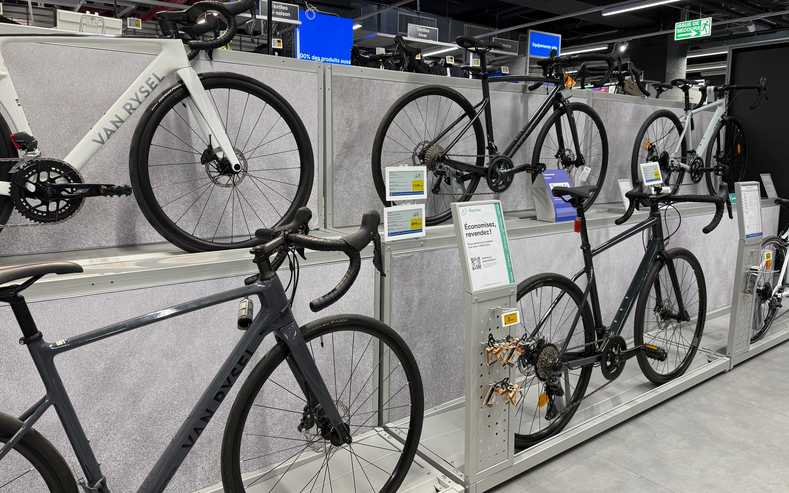

Raphaへ聖地巡礼、五体投地。
<!--more-->
　  

### 久しぶりのヨーロッパ

　観光というより静養をしにパリへ行ってきました。特に何も予定は入れずに、ホテルの近所をぶらぶらと歩いてコーヒーを飲んだり、スーパーマーケットで食品を買って何もしない日を過ごしていました。医師からも普段の環境と違うところで頭を切り替えるとよいとアドバイスをいただいていたので、観光地ではない日常生活をパリで過ごすのが良さそうと考えて行ってきました。家にいるとベッドで寝てばかりで、外出もおっくうになってしまうのですが、ホテルの近くには美味しいパン屋さんやカフェが徒歩１分のところにあり、自分のフランス語能力を回復するのにも良い環境で、おかげで朝起きてからホテルのお兄さんと世間話をしたあとに買い物へ出掛け、夕方前には疲れて晩御飯は簡単なものを食べるだけで早々に寝るという健全な生活リズムで滞在を楽しむことができました。
　  
### ロンドンにも２日滞在  
　ロンドン滞在の主な目的はRaphaへ行くことと、ユーロスターでパリに行くことだけだったので短い滞在となりました。行ってみたい場所は他にもあったのですが、欲張らずにカフェでコーヒーを飲んで、まったりとした時間を過ごすだけでも良い滞在になったと思います。英語での会話も楽しくて、とりわけRaphaではネットでセール中だった時期でしたが、定価で思いっきり買い物をしてしまったので、しっかりと自転車に乗ろうと思い直すきっかけになりました。  

  
  
  
  　  
