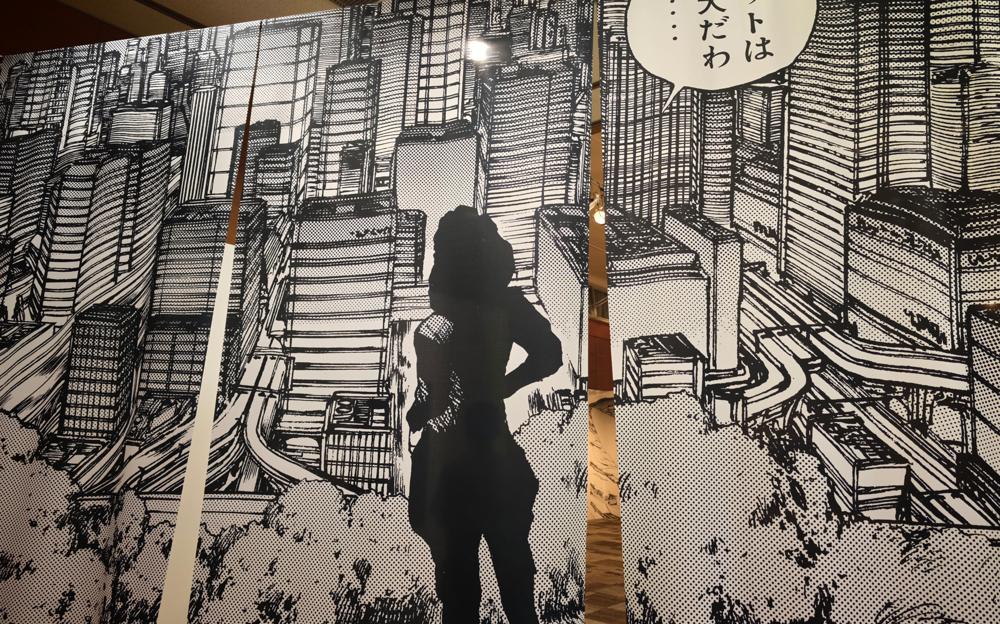
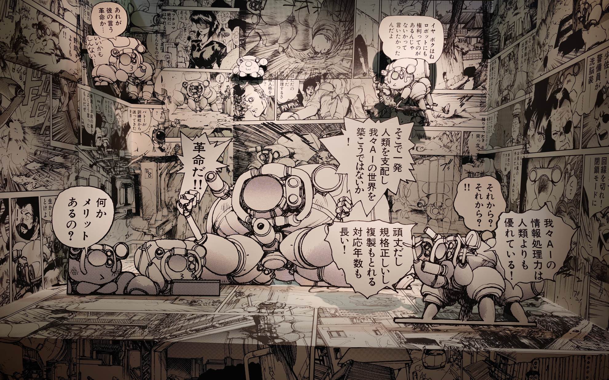

何かやりたいことが思い浮かばない。
<!--more-->
　  

### 秋口になると体調が悪い

　今年に入っていろいろな出来事がありました。今まで困難な状況に直面したときに、自分を奮い立たせてきた元気みたいなものが夏を過ぎた頃から足らなくなってきたみたいで、仕事では情報共有がされていないまま作業をしていたため、後から正しい情報をもらって作業をやり直すようなことや、組織と組織の縄張り争いの板挟みに悩んでしまったりして、普段なら気にしないような些細なことも精神的にダメージを受けるようになりました。  
　  
　本来ならできることができなくなってきて、休みの日は夕方までベッドで白昼夢を見るような生活になってしまったので、何とかしないといけないなぁと考えています。好きなことをやればいいのですが、好きなことをやる元気も出てこず、「何が好きなんだっけ・・・」とふと考えてしまうこともあります。  
　  
  
　  
　そうは言いつつ、ツール・ド・フランスはキチンと見ていて、自転車はやっぱり好きだし、先日は名古屋の栄で開催された「士郎正宗の世界展」へ行くことができました。高校生くらいの時から好きな漫画で、たびたび映画化やアニメになって、今年再び原作テイストで放送されたのを毎週楽しみに見ていました。今振り返ると、今年もそこそこ人生を楽しむことができているみたいなので、あまり悲観的にならないで、人生を好きなように楽しんでいきたいと思います。

  
